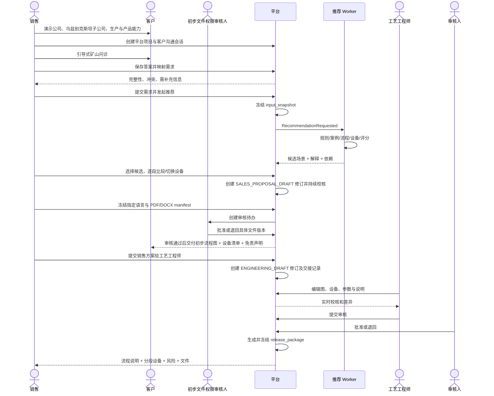

# 用户角色、权限与工作流

## 1. 角色

| 角色 | 主要权限 | 明确禁止 |
|---|---|---|
| Sales | 演示企业内容、主持客户问诊、发起推荐、比较多设备选项、编辑销售方案、生成初步打印件、提交工程 | 修改工艺拓扑、规则、正式设备数据，或把初步方案标为工程批准 |
| PreliminaryHandoutReviewer | 使用 `customer.handout.review` 审核冻结的初步客户文件 | 修改销售方案、代替工艺审核，或审核内容发生变化后的旧版本 |
| ContentEditor | 持有 `sales_platform.content_edit` 后维护页面结构、源语言和展示草稿 | 未经审核直接发布、注入任意 HTML/JS、查看无权限客户项目 |
| ContentTranslator | 持有 `sales_platform.content_translate` 后维护被分配 locale 的译文 | 批准自己的受限语言版本（默认）、改变语言无关页面结构 |
| ContentReviewer | 持有 `sales_platform.content_review` 后审核指定 locale、客户安全与预览 | 修改已冻结 release、绕过媒体权利门禁 |
| ContentPublisher | 持有 `sales_platform.content_publish` 后定时发布或回滚 ContentRelease | 修改历史 release manifest |
| MediaManager | 持有 `sales_platform.media_manage` 后上传、复用、裁切和停用媒体 | 物理删除历史 release 引用资产、忽略授权到期 |
| ProcessEngineer | 编辑工程修订、校核、写说明、提交审核 | 修改已发布版本、跳过强制红线 |
| EngineeringReviewer | 退回/批准工程修订、批准带条件警告 | 原地修改提交内容 |
| DataSteward | 持有 `sales_platform.data_maintain` 后导入、映射、提出数据变更、处理质量问题 | 单独发布高风险规则/规格（可配置） |
| ProductImportReviewer | 审核产品 Excel 的区域、字段映射、型号/图号匹配和字段 diff | 用低置信度/冲突记录批量覆盖正式设备规格 |
| RuleOwner | 编辑规则和测试、提交规则审核 | 对未通过测试规则发布 |
| Publisher | 发布设备/规则/案例/销售方案版本 | 修改历史发布物 |
| Admin | 角色映射、系统配置、复核策略 | 绕过业务审计 |
| BmsControlOperator | 按 BMS 菜单与功能权限进入管理中心，查看任务型投影并执行已授权动作 | 直连业务库、用缓存批准/发布、越过 Sales Platform 状态机 |
| AlgorithmService | 读取已发布快照、写推荐运行结果 | 读草稿数据、发布销售方案 |

身份来自 BMS。本平台保存 BMS 外部主体引用、本地角色/资源范围映射和最近同步时间，不保存 BMS 口令。角色来自权限映射，不依赖“团队负责人”等组织职级名称。

BMS 菜单角色不是新的领域超级角色。内容、翻译、媒体、设备、案例、规则、handout、业务历史查看和权限管理分别使用精确权限；页面可见性、按钮可用性和 Sales Platform 服务端授权必须一致。所有页面（含表格/列表页）与按钮权限都在 BMS 菜单管理创建，前端不写死业务路由；正式 BMS `functionCode` 再与上述逻辑权限建立映射。

## 2. 销售看板到工程发布主流程



## 3. 销售会谈状态机

```text
DRAFT → IN_PROGRESS → ANSWERS_COMPLETE → RECOMMENDING
      → PROPOSAL_READY → SUBMITTED_TO_ENGINEERING → CLOSED
```

会谈答案完成并不代表工程输入充分；推荐前仍要经过需求完整性和红线校验。重新联系客户补充资料时，可重开会谈并生成新的需求版本。

## 4. 销售方案状态机

```text
SALES_DRAFT
  → READY_FOR_CUSTOMER
  → SUBMITTED_TO_ENGINEERING
  → ACCEPTED_BY_ENGINEERING
  → SUPERSEDED / CANCELLED
```

打印行为单独产生不可变 `CustomerHandout`，不把方案状态简单改为 `PRINTED`，因为同一销售修订可生成多种语言/格式。每个 handout 经过 `GENERATING → PENDING_REVIEW → APPROVED_FOR_DELIVERY`，或被 `REJECTED`；内容、语言、格式或免责声明变化后必须生成新 handout 并重新审核。提交工程后冻结该修订；需要再改时从它创建新修订。

## 5. 初步客户文件审核

```text
GENERATING → PENDING_REVIEW → APPROVED_FOR_DELIVERY → SUPERSEDED
                           ↘ REJECTED
              GENERATING ↘ FAILED
```

- 审核人由 `customer.handout.review` 权限决定，不绑定职级。
- 默认 `reviewer_subject_id != generated_by`；紧急自审是否允许仍待产品确认。
- 审核对象是冻结 manifest、locale、PDF/DOCX checksum 与免责声明版本。
- 未批准文件只能内部预览，不允许打印、下载为客户交付件或标记已交付。
- 该审核不是工艺审核；文件仍显示“未经最终工艺审核”。

## 6. 需求状态机

```text
DRAFT
  → VALIDATING
  → READY
  → SNAPSHOTTED
  → SUPERSEDED
```

- `DRAFT` 可编辑。
- `VALIDATING` 运行字段、单位和冲突校验。
- `READY` 可创建推荐快照。
- `SNAPSHOTTED` 对应版本不可变；后续修改生成新需求版本。
- `SUPERSEDED` 被新版本替代，但仍可追溯。

## 7. 推荐运行状态机

```text
QUEUED → RUNNING → SUCCEEDED
                 ↘ FAILED
                 ↘ CANCELLED
```

`RUNNING` 内部阶段：`NORMALIZING`、`RULE_FILTERING`、`CASE_RETRIEVAL`、`PROCESS_ASSEMBLY`、`FEASIBILITY_CHECK`、`EQUIPMENT_SIZING`、`SCORING`、`EXPLAINING`。

失败必须包含 `failure_code`、用户可读说明、可重试标志和诊断关联 ID。

## 8. 工程方案状态机

```text
ENGINEERING_DRAFT
  → VALIDATING
  → REVIEW_REQUIRED
  → APPROVED
  → RELEASED
  → SUPERSEDED / WITHDRAWN
```

### 提交审核前的门禁

- 图中不存在孤立节点（允许明确标记的输入/输出端点）。
- 循环边必须显式标记并通过循环规则。
- 每个需要设备的工艺节点至少有一条配置。
- 产能、给料粒度、产品粒度、湿/干式、运输、电力等强制校核通过。
- 所有 WARN 已确认；人工覆盖有原因。
- 工艺说明覆盖每个发布节点。
- 输入快照和依赖未丢失。

## 9. 销售需求变化

发布后客户若调整产能、矿石、产品指标或场地条件：

1. 从原需求创建新版本。
2. 生成新输入快照并重新推荐，或由工程师明确选择“基于旧方案分支”。
3. 新方案发布后，旧方案标记 `SUPERSEDED`，但销售仍可查看历史。
4. 禁止在旧 PDF 上手工改数字后继续使用。

## 10. 数据发布工作流

```text
原始资料 / 手工录入
  → STAGED
  → VALIDATED
  → REVIEW_REQUIRED
  → APPROVED
  → PUBLISHED
  → SUPERSEDED / RETIRED
```

只有映射到 `sales_platform.data_maintain` 的主体可以进入数据更新中心或提出正式数据变更。高风险数据（能力上限、给料粒度、运输重量、工程规则、回收率等）仍默认要求提出/审核/发布分离；一个总权限不能自动绕过业务职责分离。

## 11. 企业展示内容更新工作流

```text
创建页面修订 / 改区块 / 选媒体
  → 源语言完成
  → 其它语言产生 MISSING 或 STALE 任务
  → 人工或 LLM_DRAFT 翻译
  → 对应语言审核
  → 四语言/媒体/版权/响应式预览门禁
  → Content Publisher 冻结并发布 ContentRelease
  → Web/Electron 通过 ETag 原子切换
```

内容权限与 `sales_platform.data_maintain` 分开。源语言字段变化只把受影响译文标记为 `STALE`，不清空译文；历史 release 和客户会谈引用保持不变。回滚通过重新激活上一 release 或创建后继 release 完成，不修改旧 manifest。

## 11. 并发与锁

- 工程修订采用乐观锁 `row_version`，保存冲突时返回差异，不做最后写入者覆盖。
- 销售方案修订同样使用乐观锁；提交工程后只读。
- 初步打印件和正式发布包都使用幂等键与 manifest checksum，禁止覆盖旧文件。
- 初步文件审核使用唯一活跃审核约束；批准时再次校验 manifest checksum，防止审核后内容漂移。
- 同一修订只能有一个活跃审核请求。
- 审核提交后冻结该修订；退回后生成或重新开放草稿修订。
- 发布 API 使用幂等键和数据库唯一约束。
