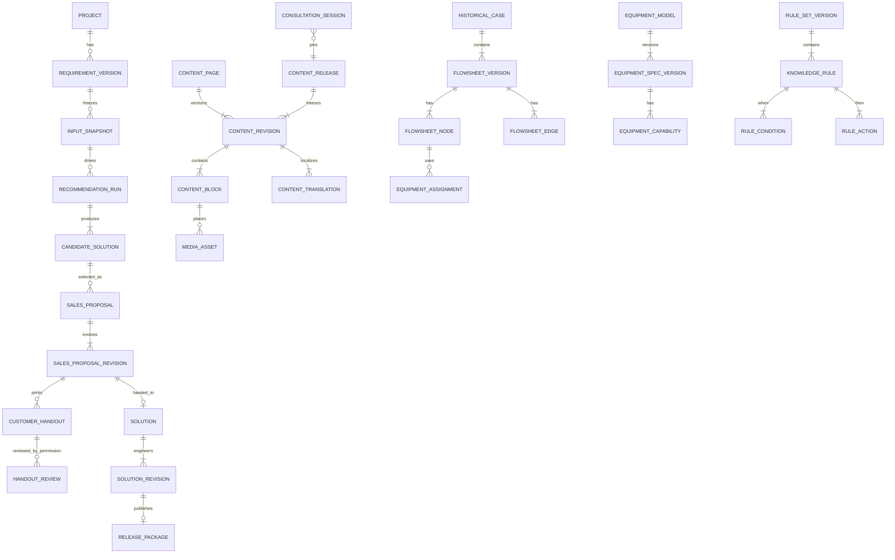

# 领域模型

## 1. 限界上下文

| 上下文 | 聚合根 | 职责 |
|---|---|---|
| Project Intake | Project, RequirementVersion | 平台内建项目、输入采集、单位归一化、时区与快照 |
| Sales Experience | ContentPage, ContentRevision, ContentRelease, MediaAsset, ConsultationSession, QuestionnaireVersion | 结构化多语言客户演示内容、媒体、发布包、会谈与引导式问诊 |
| Master Data | DictionaryTerm, UnitDefinition | 标准编码、同义词、单位与转换 |
| Equipment Catalog | EquipmentModel, EquipmentSpecVersion | 型号、版本、能力包络、运输/运行约束 |
| Case Library | HistoricalCase, FlowsheetVersion | 历史案例、流程图、实际表现和证据 |
| Knowledge Rules | RuleSetVersion | 条件、动作、测试、审核和发布 |
| Recommendation | RecommendationRun, CandidateSolution | 不可变输入与依赖、候选、评分、解释 |
| Sales Proposal | SalesProposal, SalesProposalRevision | 销售选择、逐段设备备选、现场调整与工程交接 |
| Engineering Solution | Solution, SolutionRevision | 销售选择后的工程深化、差异、校核和审核 |
| Release | ReleasePackage | 面向销售的不可变输出及导出文件 |
| Customer Handout | CustomerHandout, HandoutReview | 面向客户的初步流程图、设备清单快照和权限型审核 |
| Data Governance | ChangeRequest, QualityIssue | 暂存、变更、审批、复核、影响分析 |
| AI Assistance | LlmRun | 首期受控 LLM 调用、输入/输出血缘、成本与人工处置 |

### Project

- 由 Sales Platform 创建，是需求、会谈、推荐、销售修订和工程方案的内部聚合根。
- 不要求外部销售项目、报价或 CRM 项目 ID；未来外部引用只能作为可选关联。
- 保存矿山所在地 `site_time_zone`（IANA 标识）和创建者当时的 `created_time_zone`，业务时间戳仍以 UTC 持久化。

## 2. 关键不变量

### RequirementVersion

- `SNAPSHOTTED` 后不可变。
- 数值必须保存原始值/单位与标准化值/单位。
- “未知”与 `0` 不得混同。
- 关键输入必须带来源：客户提供、试验报告、现场勘察、销售估计等。

### EquipmentSpecVersion

- 一个设备型号同一时间最多一个 `PUBLISHED` 生效版本。
- 能力不是单一最大值，而是带适用条件、来源和置信度的 envelope。
- 运输尺寸/重量与运行尺寸/重量分开。
- 发布版本不可修改，只能创建后继版本。

### FlowsheetVersion

- 节点编码在版本内唯一。
- 边的两端必须属于同一流程版本。
- 允许平行边和循环；循环必须显式标记。
- 展示坐标不参与工程顺序判断。
- 已发布版本不可修改。

### RecommendationRun

- 只引用一个不可变 `input_snapshot`。
- 锁定算法、规则集、设备目录、案例库和特征 Schema 版本。
- 候选淘汰理由与最终评分分解必须持久化。
- 重跑生成新 Run，不覆盖旧 Run。

### SalesProposalRevision

- 基于一个算法候选或前一销售修订创建；算法候选保持不可变。
- 每个需要设备的工艺节点至少保留一个选中项，并可保存多个备选项及排序理由。
- 销售只能选择已发布设备规格；超出推荐列表必须填写理由并生成工程确认标记。
- 提交工程后冻结；修改必须创建后继修订。
- 初步打印件引用固定销售修订和 manifest，不随后续选择变化。

### CustomerHandout / HandoutReview

- 一个 handout 固定引用一个销售修订、一个 locale、一个 manifest 和一组 PDF/DOCX 文件 checksum。
- 状态到 `APPROVED_FOR_DELIVERY` 前不得作为客户交付文件下载或打印。
- 只有 `customer.handout.review` 权限主体能批准/退回；默认审核人与生成者不同。
- 内容、语言、格式或免责声明变化会产生新 handout，不复用旧批准。
- 权限审核不等于工艺审核，初步文件始终保留相应免责声明。

### ContentRevision / ContentRelease

- 页面/区块结构与 locale 文本分离；`zh-CN`、`en`、`ru`、`uk` 共享结构但独立审核。
- 源字段 checksum 变化时相关译文进入 `STALE`，不清空既有译文，也不得继续作为新 release 的已批准译文。
- 媒体二进制不进入 MySQL；MediaAsset 保存 checksum、权利、原图位置与派生 variant 元数据。
- ContentRelease 冻结页面修订、翻译、媒体、排序和 checksum；发布后不可原地修改。
- 客户会谈固定实际展示的 release/page/locale/checksum，后续内容更新不改写历史。
- 客户端更新必须原子切换完整 release；下载或校验失败时继续使用上一已验证版本。

### LlmRun

- 保存 purpose、provider、model、prompt/template 版本、输入 checksum、输出引用、token/成本、延迟和状态。
- 输出必须关联人工接受/拒绝/修改结果或确定性校核结果。
- 不得直接成为 PUBLISHED 设备规格、工程规则、正式流程或审核决定。

### SolutionRevision

- 基于一个候选方案或先前修订创建。
- 审核中的修订冻结编辑。
- 人工覆盖规则/警告必须有原因、操作者和时间。
- 正式发布引用一个已批准修订，并冻结完整内容。

## 3. 核心实体关系



## 4. 流程图模型

### 节点

节点表示工艺操作，而不是设备型号。建议基础类型：

```text
ROM_FEED, PRIMARY_CRUSHING, SECONDARY_CRUSHING, SCREENING,
WASHING, SCRUBBING, DESLIMING, GRINDING, CLASSIFICATION,
MAGNETIC_SEPARATION, GRAVITY_SEPARATION, FLOTATION,
THICKENING, FILTRATION, DEWATERING, WATER_RECOVERY,
CONCENTRATE_STORAGE, TAILINGS_DISPOSAL
```

具体字典必须由工艺团队确认并发布，以上仅是设计示例。

### 边/物流

边代表固体、矿浆、水、空气或药剂流。关键字段：来源/目标端口、物流角色、干矿量、水量、固体浓度、P80、最大粒度、含水率、品位/化验 JSON、循环标志。

### 设备配置

设备是节点的配置：型号版本、总数、运行数、备用数、单机/合计能力、利用率、配置附件和选择理由。一个节点允许多组并联或不同职责设备。

## 5. 需求事实模型

### 矿石

- 矿种/矿物组合
- 原矿品位、目标品位/回收率
- 最大粒度、P80、粒度分布
- 含水率、含泥量、黏土特性
- 密度、硬度、Bond 功指数、磨蚀性
- 氧化程度、矿物解离与选矿试验引用
- 变异性/矿体分区

### 设计基础

- t/d、运行小时、可用率、设计裕量、设计 t/h
- 生产线数量、扩产目标
- 产品粒度、含水率、品位、回收率
- 供水/回水目标、粉尘和环保要求

### 场地与基础设施

- 海拔、温度、场地尺寸、地基、吊装能力
- 可用水、电力、供电可靠性、电压、压缩空气
- 维修能力、备件策略、自动化水平

### 运输道路

- 最大车宽/高/长
- 最大单件重量、桥梁限重
- 最大坡度、最小转弯半径
- 季节性限制、集装箱要求、现场组装能力

## 6. 版本与血缘

所有推荐和发布物依赖：

```text
input_snapshot_id
algorithm_version
rule_set_version_id
equipment_catalog_snapshot_id
case_library_snapshot_id
feature_schema_version
document/evidence references
```

数据更新不能改变历史结果。影响分析只标记旧结果“可能受影响”，用户主动重跑产生新 Run。

## 7. 领域事件

- `RequirementSnapshotCreated`
- `RecommendationRequested`
- `RecommendationCompleted`
- `CandidateSelectedBySales`
- `SolutionRevisionSubmitted`
- `SolutionRevisionApproved`
- `SalesPackageReleased`
- `DataChangeRequested`
- `EquipmentSpecificationPublished`
- `RuleSetPublished`
- `HistoricalCasePublished`
- `SalesConsultationCompleted`
- `SalesProposalRevisionReady`
- `PreliminaryCustomerHandoutGenerated`
- `PreliminaryCustomerHandoutApproved`
- `SalesProposalSubmittedToEngineering`
- `RecommendationImpactDetected`

事件通过事务 Outbox 发布，消费者必须幂等。
