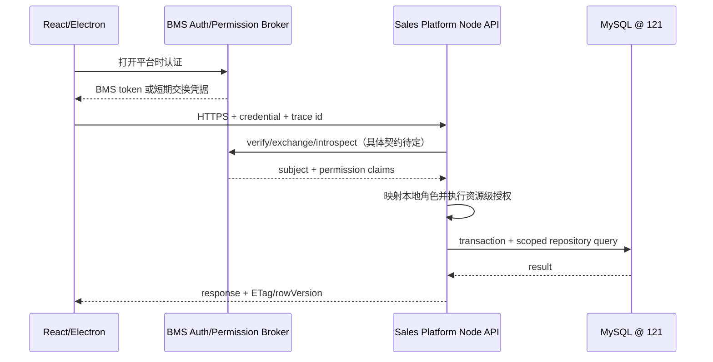
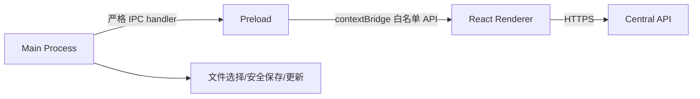

# 系统架构设计

## 1. 技术基线

| 层 | 推荐技术 | 理由 |
|---|---|---|
| API | TypeScript, Node.js, NestJS + Fastify | 模块边界、DI、OpenAPI、验证与 Fastify 适配 |
| 数据访问 | Kysely + `mysql2` + 显式 SQL migration | 类型安全但保留 MySQL/复杂 SQL 控制权 |
| 数据库 | 121 上的独立 MySQL schema（InnoDB） | 关系事务、外键、JSON、生成列索引和运维复用 |
| 队列 | Redis + BullMQ | Node Worker、重试、延迟、父子任务；业务事实仍在 MySQL |
| 图算法 | Graphology `MultiDirectedGraph` | 运行时有向多重图、遍历、环与连通性校验 |
| 规则 | 自有受限 DSL；可用 `json-rules-engine` 作执行适配 | JSON 可持久化、无 `eval`；工程语义仍由本项目约束 |
| LLM | Phase 1 受控实验，通过可替换 `LlmGateway` | 先验证提取、翻译/说明草稿和候选建议价值；不允许端到端正式选型 |
| 企业展示内容 | 内置结构化 CMS + 对象存储媒体库 + ContentRelease | 改字换图不依赖 Web/Electron 重新发版；保留权限、四语言和历史会谈追溯 |
| 向量 | MVP 不作为主依赖；有评测收益后接独立服务 | 不假设 121 的 MySQL 版本形态支持向量能力 |
| Web UI | React + TypeScript + Vite | 与 Electron Renderer 复用 |
| 流程编辑 | React Flow | 自定义工艺节点、多个输入/输出端口和边交互 |
| Desktop | Electron Main + Preload + Renderer | Windows/macOS 同批次；桌面文件、导出、更新；业务逻辑在服务器 |
| 文件 | S3/MinIO 兼容对象存储 | 原始资料、提取结果、报告和附件 |
| BMS 管理控制面 | BMS Vue 页面 + BMS Backend BFF | 复用 BMS 菜单/权限；只取任务型投影，不复制领域数据 |

版本号在实现启动时锁定并验证，不在设计阶段伪装成永远有效的“最新版”。

## 2. 模块化单体边界

```text
apps/api/src/modules/
  identity/
  sales-experience/
  consultation/
  project-intake/
  master-data/
  equipment-catalog/
  case-library/
  rules/
  recommendation/
  sales-proposal/
  customer-handout/
  engineering-solution/
  release/
  data-governance/
  attachments/
  audit/

apps/worker/src/jobs/
  document-extraction/
  data-quality/
  feature-snapshot/
  recommendation/
  impact-analysis/
  report-generation/
  llm-experiment/
```

模块之间不得直接读对方私有表的 repository。跨模块读使用公开查询端口，跨模块写使用应用服务或领域事件。

## 3. API 请求路径



Sales Platform 已确认是 BMS/CRM 外部系统，且项目由平台自行创建。BMS 后端提供打开平台时的认证与权限交换适配；具体 token、刷新、退出和正式权限码尚需确认，Identity Adapter 不能在设计阶段硬编码猜测。平台业务后端部署在独立服务还是其它受控运行单元也仍待决定，但不得把领域表混入 BMS 表结构。

内部管理采用另一条请求路径：`BMS Vue → BMS Backend BFF → Sales Platform Admin API → MySQL/Object Storage`。BMS 保存菜单、权限映射与必要集成配置，业务项目、内容、设备、案例、规则、推荐、handout 和发布历史不落 BMS 业务表。BMS 页面需要的总览、待办、详情和审计由任务型 projection 提供；审核/发布禁止使用过期缓存。

## 4. 异步任务

1. API 在业务事务中写业务表与 `outbox_event`。
2. Outbox Relay 将事件推入 BullMQ；`event_id` 作为幂等键。
3. Worker 记录 `job_run`，按阶段更新进度和心跳。
4. 结果写入 MySQL；大文件写对象存储。
5. 完成事件通过 SSE/WebSocket（MVP 推荐 SSE）通知 UI。

Redis 丢失不能丢业务事实：Outbox 可重新投递，Worker 写入使用唯一键/幂等条件。

## 5. 数据读取模式

- 写模型：高度规范化，强调约束、版本和审计。
- API 查询：针对页面建立 SQL view/read repository。
- 算法：使用 `case_feature_snapshot`、`equipment_feature_snapshot`、`rule_set_snapshot`。
- 报告：使用发布时生成的 `release_manifest`，不实时拼接会变化的主数据。

## 6. Electron 架构



允许的桌面桥示例：`selectFiles`、`saveExport`、`getAppVersion`、`onUpdateStatus`。禁止暴露通用 `ipcRenderer.send`、`fs`、`shell` 或命令执行。

Electron 可以复用网站的 React 页面，但不只是“把网站放进 exe”：Windows/macOS 仍需要各自的安装包、代码签名、自动更新、协议/文件关联、打印/保存路径和安全验收。前端计划放在独立仓库；本仓库继续作为领域、数据库和契约设计基线，正式仓库名待确认。

## 7. 多语言与时区

- 客户可见内容以 `zh-CN`、`en`、`ru`、`uk` 四个独立 locale 版本发布；俄语与乌克兰语不共享同一文案版本。
- 缺少客户输出的关键翻译、免责声明或设备术语时阻止生成，不静默回退成另一语言。
- 企业展示页面结构只维护一份，翻译按 locale 挂载；发布冻结结构、文本、媒体 variant 和 checksum 的 ContentRelease。
- Web/Electron 使用 current-release API、ETag 和本地缓存；新 release 未完整下载/校验前不切换，离线继续展示上一完整发布包。
- CMS 只接受白名单结构化区块；不把任意 HTML/JavaScript 或远程脚本送入 Electron Renderer。
- 所有数据库时间戳保存 UTC；Project 保存矿山所在地 IANA 时区，Subject 保存偏好时区，Consultation 保存会谈时区。
- API 使用 ISO 8601；UI 和 PDF/DOCX 同时显示当地日期时间、时区缩写/UTC 偏移，manifest 保存 UTC 原值和 IANA zone。
- 时区换算由应用层使用经过验证的时区库完成，不依赖 121 已加载 MySQL time zone tables。

## 8. 依赖方向

```text
delivery (controllers/jobs/electron)
  → application (use cases)
  → domain (entities/policies/ports)
  ← infrastructure (mysql2/queue/storage/identity adapters)
```

领域包不依赖 NestJS、Electron、Kysely 或 BullMQ。

## 9. 扩展策略

满足以下任一证据后才拆服务：

- 推荐任务需要独立弹性/硬件或不同发布周期；
- 文档提取存在独立安全区；
- 团队所有权和 SLA 明确不同；
- 单体数据库事务不再是主要收益；
- 可观测性显示某模块是持续瓶颈。

拆分优先候选为 Document Extraction、Recommendation Worker、Report Generation；核心版本与审核仍优先保留同一事务域。

## 10. 官方资料依据

- Electron 官方安全建议要求 Context Isolation、Sandbox、限制导航/新窗口、验证 IPC sender，并避免向不可信内容暴露 Electron API：<https://www.electronjs.org/docs/latest/tutorial/security>
- NestJS 支持通过 HTTP adapter 使用 Fastify：<https://docs.nestjs.com/faq/http-adapter>
- React Flow 支持自定义节点和多个连接 Handle：<https://reactflow.dev/learn/customization/custom-nodes>
- Graphology 支持 directed multigraph：<https://github.com/graphology/graphology>
- BullMQ 提供 Queue/Worker/FlowProducer 模型：<https://docs.bullmq.io/guide/introduction>
- MySQL InnoDB 提供 ACID 事务、行级锁和外键：<https://dev.mysql.com/doc/refman/8.4/en/innodb-introduction.html>
- MySQL JSON 标量路径可通过 generated column 建索引：<https://dev.mysql.com/doc/refman/8.4/en/generated-column-index-optimizations.html>
