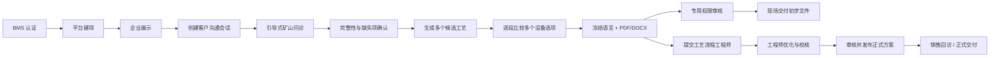

# 销售看板与客户沟通完整旅程

## 1. 产品定位

“销售看板”是 Sales Platform 中由销售人员面对客户使用的 React + Electron 工作台。Sales Platform 独立于 BMS/CRM，但打开时使用 BMS 认证，并在平台内直接创建 Project。它不是单纯的推荐结果页面，而是一次完整会谈的承载工具：先介绍公司与能力，再引导客户回答矿山问题，随后生成并调整初步工艺与设备方案，最后由专用权限审核人检查冻结文件，现场交付并提交工艺流程工程师深化。

销售看板与内部工程工作台共享同一平台和数据，但必须使用不同的信息投影、权限和视觉模式。面向客户的页面不得暴露内部评分权重、敏感案例、底价、内部规则原文或其他客户资料。

## 2. 完整客户旅程



任何阶段都可记录“待客户补充”和“需要人工设计”。信息不足时不能为了完成演示而生成伪精确结果。

## 3. 第一部分：企业展示

建议以可配置内容集合承载，而不是把文案和图片写死在 Electron 包中：

- 公司介绍：历史、定位、资质、服务能力。
- 乌兹别克斯坦子公司介绍：当地团队、服务覆盖、联系方式和能力边界。
- 生产能力介绍：厂房、制造、检测、交付和现场服务能力。
- 产品/功能介绍：主要设备系列、适用工艺段、客户价值和典型能力。
- 案例展示：只显示已获授权、已脱敏且处于发布状态的案例。
- 媒体内容：图片、视频、PDF、三维/动画链接及中文、英语、俄语、乌克兰语版本。

内容采用 `DRAFT → REVIEW_REQUIRED → PUBLISHED → SUPERSEDED` 生命周期。每次客户展示会话记录所使用的内容版本，以便追溯当时客户看到了什么。

第一部分由内置结构化 CMS 维护：页面/区块结构只维护一份，`zh-CN`、`en`、`ru`、`uk` 各自保存翻译和审核状态。内容人员可使用页面树和固定区块修改文字、换图、拖动排序、预览桌面/窄屏、定时发布和回滚，不接触 React 代码。图片进入媒体库，通过 checksum 去重，保存尺寸、焦点、响应式 variant、版权/客户授权和到期时间；默认跨语言共用，图片含文字时可指定 locale 专用版本。

发布冻结不可变 `ContentRelease`。Web/Electron 通过 ETag 和 manifest checksum 自动更新，内容变化不要求重新发布安装包；离线或下载失败继续使用上一完整发布包。源语言改动只把相关译文标记为 `STALE`，不会清空人工译文，也不能把过期译文混入新 release。详细设计见 `docs/content-management/design.md`。

## 4. 第二部分：客户沟通问诊

### 4.1 问卷分组

1. 客户与平台项目：矿山位置、项目阶段、新建/改造、联系人、预计时间和矿山所在地 IANA 时区；不要求外部销售/CRM 项目 ID。
2. 矿山与矿石：矿山类型、矿石类型、主要有价/脉石矿物、氧化程度。
3. 粒度与物性：最大给料粒度、P80、含水、含泥、密度、硬度、磨蚀性。
4. 处理目标：t/d、运行小时、产品粒度、品位、回收率、脱泥/洗矿/脱水要求。
5. 水电与基础设施：供水、回水、电压、可用功率、场地、地基、吊装和维修能力。
6. 道路与运输：桥梁限重、道路宽高、坡度、转弯半径、季节性通行和现场组装。
7. 商务偏好：可靠性、能耗、占地、扩产、自动化和设备品牌偏好。价格与交期仍由正式报价流程确认。

### 4.2 问题模型

- 问卷模板和问题都需要版本化。
- 支持单选、多选、数值+单位、文本、布尔、附件和“未知”。
- 支持条件跳转，例如选择“需要脱水”后才显示产品水分目标。
- 每个答案映射到标准需求字段，并保留客户原话、原单位、来源和销售备注。
- 客户估计值、销售估计值和试验报告值必须区分。
- 会话完成后生成不可变 `RequirementVersion` 与 `InputSnapshot`，后续改答案必须创建新版本。

## 5. 第三部分：推荐与销售调整

### 5.1 推荐结果

系统至少返回一个平衡方案；数据允许时可提供高可靠、低水耗、低能耗、运输受限或扩产友好等场景。每个场景包含：

- 可缩放流程图和逐段说明；
- 每个工艺段 1–N 个设备选项；
- 每个选项的型号、规格版本、总数、运行数、备用数、能力、功率、运输重量；
- 推荐顺序、适用条件、选择理由、约束命中、风险和待确认项；
- 为什么其他设备不适合或排名较低。

### 5.2 销售方案修订

销售选择算法候选后，平台创建 `SalesProposalRevision`，而不是立即创建工程修订。

销售可：

- 在每个工艺段的推荐设备选项之间切换；
- 修改设备数量、运行/备用配置，但必须实时重新校核；
- 搜索目录中其他已发布设备；超出推荐清单时必须填写原因并标记“工程确认必需”；
- 记录客户品牌、占地、能耗、运输、备机等偏好；
- 对工艺段提出修改意见，但不直接修改工艺拓扑或工程参数。

销售不可：

- 修改设备规格主数据、规则或历史案例；
- 绕过硬约束把不适用设备标记为可用；
- 把销售方案标记为“工程已批准”；
- 在没有工艺人员权限时增删流程节点、修改物流或承诺回收率。

每次保存形成可追溯修订；算法原稿保持不变。UI 同时显示“算法推荐”“销售当前选择”和“待工程确认”差异。

## 6. 客户打印件与工程回传

### 6.1 现场初步方案

销售可从 `SalesProposalRevision` 生成不可变 `CustomerHandout`，选择 `zh-CN`、`en`、`ru` 或 `uk` 和 PDF/DOCX：

- 封面、客户/项目摘要；
- 需求与设计基础摘要；
- 工艺流程图；
- 工艺段与设备列表；
- 型号、数量、主要能力和选择理由；
- 假设、缺失资料、待客户确认项；
- 方案编号、修订号、当地生成时间、IANA 时区、UTC 偏移和二维码/校验码（可选）。

由于此时工艺工程师可能尚未完成审核，打印件必须显示：

> 初步技术交流方案，基于客户当前提供信息生成，未经最终工艺审核，不构成合同、性能保证或最终设备承诺。

生成后状态先进入 `PENDING_REVIEW`。只有持有 `customer.handout.review` 权限的指定人员可以批准或退回；该人员不绑定团队负责人职级，也不要求是工艺工程师。批准后才能打印/下载为客户交付件。打印后再修改会产生新的销售修订和新的打印件；旧文件和旧审核不能被覆盖或复用。

### 6.2 提交工程师

销售点击“提交工艺工程师”后，系统冻结该销售方案修订并创建工程交接记录。交接内容包括：

- 原始问答与输入快照；
- 算法候选及全部依赖版本；
- 销售最终选择的流程和设备；
- 未选择的设备备选及原因；
- 销售修改、客户偏好、现场备注和已打印文件；
- 所有 BLOCKER/WARN、缺失资料和必须确认项。

工艺工程师以此创建 `SolutionRevision 1`，可调整流程拓扑、物流、设备、数量、参数和说明。正式审核发布后形成 `ReleasePackage`；它与现场初步打印件是两个不同的交付等级。

## 7. 页面信息架构

企业展示的板块、二级页面、动态详情模板、讲解路线与后台维护边界见 `docs/frontstage-secondary-pages/design.md`。该文件当前为 Draft，后续逐页补充内容与交互细节。

```text
销售看板
  今日会谈 / 最近项目
  企业展示
    公司介绍
    乌兹别克斯坦子公司
    生产与服务能力
    产品与功能
    授权案例
  客户沟通
    新建会谈
    引导式问卷
    资料与附件
    完整性确认
  方案生成
    候选场景比较
    流程图
    分段设备多选项
    销售方案修订
  客户交付
    PDF/DOCX 预览
    初步文件权限审核
    初步方案历史
    提交工程师
    正式方案回传
```

客户在旁观看时启用“演示模式”：隐藏内部导航、内部评分、成本字段、其他客户和管理入口；离开演示模式需要销售重新确认。

## 8. 状态和交付等级

| 对象 | 状态 | 对客户含义 |
|---|---|---|
| Algorithm Candidate | 只读 | 内部算法候选，不直接打印 |
| Sales Proposal Draft | 可编辑 | 销售现场选择，未冻结 |
| Preliminary Handout | 不可变、待专用权限审核 | 审核通过后可带走，但带醒目初步方案声明 |
| Engineering Draft | 内部 | 工艺工程师深化中 |
| Approved Release | 不可变 | 经工艺审核的正式技术方案 |

## 9. 验收场景

- 销售可在演示模式连续完成 BMS 登录、平台建项、企业介绍、问卷、推荐、设备替换和提交打印审核，无需进入 BMS/CRM 管理页面。
- 一个工艺段可显示多个设备选项，且比较字段一致。
- 销售把设备换成能力不足或运输超限型号时，系统阻止或明确标为必须工程确认。
- 无审核权限不能批准或交付；具备权限的指定人员可以审核，不依赖职级。打印件内容来自冻结 manifest，打印后修改不会改变旧文件。
- 中文、英语、俄语、乌克兰语和 PDF/DOCX 分别可生成；关键翻译缺失时阻止交付。
- 工程师可看到完整问答、销售调整前后差异和客户已经拿到的版本。
- 正式工程方案可追溯到销售会谈、初步打印件、输入快照和算法候选。

## 10. 待确认

- BMS 中映射到 `customer.handout.review` 的正式权限码，以及是否允许紧急自审；当前默认不能自审。
- 企业展示和四语言内容由市场部、销售部、翻译人员还是海外团队维护和审批。
- 第一批网站式页面、图片原件、版权/客户授权证明和媒体存储/CDN 由谁提供。
- 销售是否允许搜索全部已发布设备，还是只能在算法备选列表内切换。
- 客户签字/确认、二维码追踪和会谈录音是否属于首期范围。
