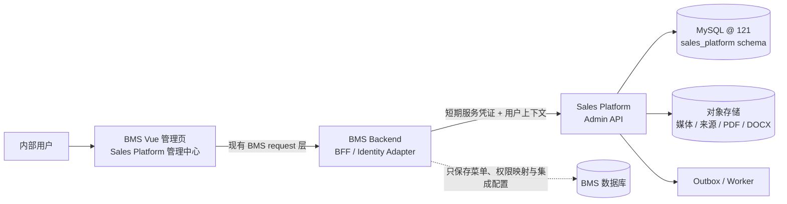
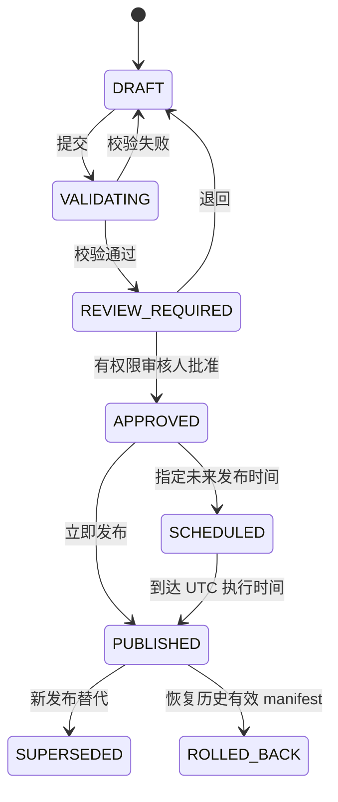
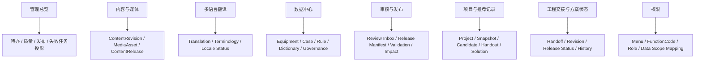

# BMS 内 Sales Platform 管理控制面设计

## Status

Draft — 供 BMS、Sales Platform、销售、工艺、数据、内容与运维负责人联合评审。本文是目标设计，不表示 BMS 中已经存在这些菜单、权限或接口。

## Summary

Sales Platform 仍是 BMS/CRM 之外的独立业务系统。BMS 内新增一个面向员工的 **Sales Platform 管理中心**，作为内部控制面：复用 BMS 现有账号、角色、菜单和权限分配能力，集中提供内容维护、翻译、设备/案例/规则数据治理、审核与发布、项目/工程记录和权限页面。审计证据保留在各业务详情与版本历史中，不单独建设“审计与运行”菜单。

BMS 不复制 Sales Platform 的项目、推荐、设备、案例、规则、内容或发布数据，也不直接连接 `sales_platform` MySQL schema。BMS 前端通过 BMS 后端的 BFF/Adapter 调用 Sales Platform Admin API；Sales Platform 的 MySQL schema 与对象存储仍是领域数据唯一可信源。

“全部数据可查看”定义为：经权限与数据范围授权后，用户可以从摘要追溯到结构化详情、版本、来源和审计；不代表在一张表中展示所有列，更不代表暴露密钥、凭据、未授权客户资料或内部敏感字段。

## Context and Scope

Sales Platform 的客户演示、问诊、推荐、设备选择、现场文件和工程深化都在独立 React/Electron/Web 应用中完成。与此同时，公司内部需要一个更适合长期治理的入口，用于：

- 修改公司介绍、乌兹别克斯坦子公司、生产能力、产品功能和授权案例图文；
- 管理中文、英语、俄语和乌克兰语翻译；
- 维护设备目录、历史案例、工艺模块、工程规则、字典与术语；
- 审核初步客户文件、内容、翻译和高风险数据变更；
- 查看项目与推荐记录、工程交接状态和发布记录；
- 按权限完成预览、批准、定时发布、回滚和历史追溯。

BMS 已知可作为人员账号、角色、权限和菜单入口的管理平台；Sales Platform 是独立系统。具体 BMS token 交换、正式菜单码、正式功能权限码和 BFF 部署方式仍需实现前签订契约。

## Goals

1. 给内部人员一个统一、可授权、可审计的数据维护与发布入口。
2. 让内容、翻译、工程数据、审核和运维按职责分离，而不是共享一个“超级管理员”。
3. 让有权人员能够逐层查看完整事实、来源、版本、影响和审计，又不造成页面和权限失控。
4. 所有正式写入通过 Sales Platform 领域 API 与状态机完成，避免双库、直接 SQL 和历史漂移。
5. 支持预览、校验、审核、定时发布、回滚、影响分析和失败恢复。
6. 保持 Sales Platform 客户/工程工作台与 BMS 管理控制面的清晰边界。

## Non-Goals

- 不把 Sales Platform 变成 BMS 的业务子模块。
- 不在 BMS 数据库复制 83 张 Sales Platform 领域表。
- 不在第一阶段把流程图工程画布、推荐解释工作台或客户演示模式重做一遍。
- 不让 BMS 前端直接连接 MySQL、对象存储或 LLM Provider。
- 不把原始数据库列名当成管理页面信息架构。
- 不在未确认 BMS 集成契约前声称具体路由、JWT 或权限码已经可用。

## Constraints

- BMS 前端沿用其现有 Vue 管理端与动态菜单机制。每个新增页面（包括表格/列表页）只创建在 `src/views/...`，必须在 BMS **菜单管理**中登记为“页面”，由 `/permission/getUserPromissions` 返回后生成侧边栏和路由；禁止写入 `src/store/modules/routes.ts`、`src/router/index.ts`，也禁止新增 legacy `inject*` 路由。
- 每个按钮或能力必须作为该页面下的“权限”子项配置；前端 `hasPermission(...)` 必须精确使用菜单管理中最终的 `functionCode`。业务权限配置页只分配已有权限，不能代替菜单管理创建页面/权限记录。
- BMS 前端通过 BMS 后端访问 Sales Platform，不把跨系统凭据下发给浏览器。
- Sales Platform 后端仍采用 TypeScript/Node.js，领域数据位于 121 服务器独立 MySQL schema。
- 所有正式业务时间保存 UTC；BMS 页面按用户选择的 IANA 时区显示，并保留 UTC 原值。
- 数据发布、客户文件审核、工程正式发布都必须保留不可变版本和审计链。
- 客户隐私、商业秘密、设备内部数据和 LLM 输入按数据分类及资源范围授权。

## Proposed Design

### 1. 系统边界

权威归属：

| 数据/能力 | 权威系统 | BMS 内是否保存副本 |
|---|---|---|
| 员工账号、角色、菜单、权限分配 | BMS | 是，沿用 BMS 当前能力 |
| BMS 权限到 Sales Platform 逻辑权限的映射 | BMS/BFF 配置 | 仅保存映射，不复制业务数据 |
| 项目、问答、推荐、销售修订、工程修订 | Sales Platform | 否，仅实时/短缓存投影 |
| 内容、翻译、媒体元数据、ContentRelease | Sales Platform | 否 |
| 设备、案例、规则、字典、质量问题 | Sales Platform | 否 |
| PDF/DOCX、媒体和来源原件 | Sales Platform 对象存储 | 否，只使用短期签名 URL |
| 领域审核、发布与变更审计 | Sales Platform | 否，BMS 展示投影 |
| BMS 登录、菜单访问、权限配置审计 | BMS | 是 |

### 2. BMS 菜单规划

顶级菜单：`Sales Platform 管理中心`

| 一级页面 | 主要用户 | 默认展示 | 主要动作 |
|---|---|---|---|
| 管理总览 | 管理员、数据/内容负责人、审核人 | 待办、质量、过期、发布、失败任务 | 进入具体待办，不在总览直接发布 |
| 内容与媒体 | 内容编辑、媒体管理员 | 页面树、区块摘要、媒体、权利状态 | 改字、换图、排序、预览、提交审核 |
| 多语言翻译 | 翻译者、语言审核人 | 四语言完成度与 `MISSING/STALE` | 编辑译文、术语检查、并排审核 |
| 数据中心 | 数据管理员、领域专家 | 设备、案例、工艺/规则、字典、来源 | 导入、提出变更、字段对比、质量处理 |
| 审核与发布 | 被指派审核人、各类 Publisher | 按本人权限聚合待审核项、待发布包、校验、影响和计划时间 | 批准、退回、写意见、定时发布、回滚；禁止越权自审 |
| 项目与推荐记录 | 销售管理、工艺、审计 | 项目状态、推荐版本、风险、负责人 | 只读详情、下载已授权文件、跳转平台 |
| 工程交接与方案状态 | 销售管理、工艺负责人 | 待接收/优化中/待补充/已发布 | 查看差异与状态，深度编辑跳转 Sales Platform |
| 权限 | 系统管理员 | 页面/功能权限映射、人员/角色和数据范围 | 配置或核对映射；不在此页创建硬编码路由 |

`数据中心`建议使用二级页签：设备目录、历史案例、工艺与规则、字典与术语、来源文档与导入、数据质量与复核。首期不把所有领域数据挤在一张“万能表”。

`来源文档与导入` 下增加 `产品 Excel 导入`：支持一个文件拆出多个 Sheet/产品区域，完成结构识别、字段映射、新增/更新/冲突对比、审核和版本发布。详细规则见 `docs/product-import/design.md`。

以上每个一级页面及其二级表格/列表页都必须先在 BMS 菜单管理配置“页面”记录，再配置按钮级“权限”子项。删除或禁用菜单记录后，前端应随权限接口结果隐藏/撤销该页面；不得靠修改 `routes.ts` 控制上线或下线。

### 3. 页面展示分层

#### 第 1 层：默认摘要列表

所有资源列表采用一致骨架：搜索/筛选、状态、版本、Owner、语言或数据域、质量/新鲜度、最后更新时间、发布时间、待办动作。默认只显示用户完成当前任务需要的 8–12 个字段。

#### 第 2 层：结构化详情

点击资源后进入抽屉或详情页，统一使用以下页签：

1. 概览：业务名称、状态、责任人、当前发布版本；
2. 当前数据：经过领域化分组的完整可读字段；
3. 版本历史：旧值/新值、变更原因、发布和回滚；
4. 翻译/媒体：按适用资源显示 locale、图片、权利和引用；
5. 来源与证据：文档、页码、原值、标准化值、confidence；
6. 影响分析：受影响推荐、内容发布或客户文件；
7. 审核与审计：提交、批准、退回、操作者和 UTC/当地时间。

#### 第 3 层：受限高级/原始视图

只对数据维护人、领域专家或审计角色开放：原始 JSON、导入行、解析结果、checksum、reason code 和技术日志摘要。默认折叠，复制/导出单独授权并记录审计。

以下内容永不以普通“全部数据”方式展示：

- 密码、JWT、API Key、数据库/对象存储凭据和私钥；
- 未授权客户 PII、商业秘密、原始客户文件正文；
- 仅供系统使用的对象存储内部 key 和供应商密钥；
- 客户安全页面不应出现的内部评分、成本、规则原文和未发布工程结论；
- 未经安全批准的 LLM system prompt、敏感输入和模型密钥。

### 4. 数据更新页面

#### 内容与媒体

- 左侧页面树；中间结构化区块编辑；右侧四语言/发布/校验状态；
- 媒体库支持上传、裁切焦点、alt text、语言覆盖、权利来源和到期；
- 预览桌面、窄屏、Electron 客户模式和四语言；
- 源语言变化只把受影响译文标记为 `STALE`，不覆盖译文；
- 编辑保存草稿，不直接影响客户正在使用的版本。

#### 工程与主数据

- 导入先进入 staging；显示 old/proposed/source/unit/confidence；
- 校验单位、范围、重复、来源、冲突、适用条件和版本；
- 设备、案例、规则使用各自领域表单，不用一张 JSON 编辑器代替；
- 高风险字段必须由对应领域审核人批准；
- 发布前显示影响范围，历史推荐与正式文件不被原地改写。
- Excel 导入结果按 `新增型号 / 新配置 / 更新 / 仅格式 / 无变化 / 冲突 / 无效` 分页筛选；字段详情并排显示数据库旧值、Excel 建议值、原文/单位和 Sheet/单元格位置。

#### 项目与推荐记录

- BMS 默认只读；支持按项目、销售、客户、矿种、状态、风险和时间查询；
- 可查看输入快照、候选、销售修改、handout、工程交接和发布关系；
- 流程图深度编辑、设备逐段比较和工程说明编写跳转独立 Sales Platform，避免双实现。

### 5. 审核和发布

发布分为四条互不混淆的轨道：

1. ContentRelease：公司展示、媒体与多语言；
2. Engineering Data Release：设备、案例、规则、字典；
3. Customer Handout Approval：现场初步 PDF/DOCX；
4. Formal Engineering Release：正式工艺方案，仍由 Sales Platform 工程流程主导。

每次发布必须包含不可变 manifest、checksum、依赖版本、审核记录、UTC 时间、显示时区和发布人。BMS 只调用发布命令，不执行直接 SQL。回滚恢复已验证历史版本或创建后继发布指针，不修改历史行。

### 6. 逻辑权限

以下是 Sales Platform 逻辑权限建议，正式 BMS `functionCode` 必须在菜单管理与集成契约中确认：

| 权限 | 能力 |
|---|---|
| `sales_platform.admin.view` | 进入管理中心与总览 |
| `sales_platform.project.view` | 查看授权范围内项目/推荐记录 |
| `sales_platform.content.edit` | 编辑结构化内容草稿 |
| `sales_platform.content.translate` | 维护指定 locale 译文 |
| `sales_platform.content.review` | 审核内容/翻译 |
| `sales_platform.content.publish` | 发布/回滚 ContentRelease |
| `sales_platform.media.manage` | 管理媒体及权利元数据 |
| `sales_platform.data_maintain` | 进入数据中心、导入和提出变更 |
| `sales_platform.equipment.review/publish` | 审核/发布设备版本 |
| `sales_platform.case.review/publish` | 审核/发布历史案例 |
| `sales_platform.rule.review/publish` | 审核/发布工程规则 |
| `customer.handout.review` | 审核初步客户文件，不绑定团队职级 |
| `sales_platform.audit.view` | 在获授权的业务详情中查看变更、审核与发布历史（无独立菜单） |
| `sales_platform.permission.manage` | 管理或核对页面、功能和数据范围权限映射 |

页面可见性、按钮可用性和服务端权限检查必须三层一致。仅隐藏按钮不是授权控制。提交人默认不能批准自己的高风险变更；发布权限不由 `data_maintain` 自动继承。

### 7. BFF / Admin API 交互

- BMS Vue 页面继续使用 BMS 现有请求层，只访问 BMS 后端；
- BMS 后端验证当前用户与精确功能权限，把 subject、组织、范围、locale、IANA 时区和 trace ID 传给 Sales Platform；
- Sales Platform 再执行本地资源级授权和状态机校验；
- 查询使用任务型 projection，避免 BMS 前端拼接多个领域接口；
- 安全 GET 投影可短时缓存，审核/发布/权限结果不得使用过期缓存；
- 写请求使用 `Idempotency-Key`，编辑使用 `If-Match`/`rowVersion`；
- 文件只返回短期签名下载 URL；浏览器不接触对象存储凭据；
- BMS/Sales Platform 都记录 trace ID，跨系统失败可关联排查；
- Sales Platform 不可用时页面显示只读故障状态，不允许把本地缓存当作可发布事实。

建议的任务型投影（接口正式路径待契约确定）：DashboardSummary、ContentWorkspace、TranslationMatrix、CatalogList/Detail、ReviewAndReleaseWorkspace、ProjectRecord、EngineeringHandoffRecord 和 PermissionMapping。

## Architecture Views

### 页面到数据的映射

### 失败模式

| 失败 | 页面行为 | 恢复 |
|---|---|---|
| BMS 身份/权限交换失败 | 禁止进入或显示会话过期 | 重新认证；不可降级成匿名管理 |
| Sales Platform Admin API 不可用 | 显示数据时间戳与只读故障态 | 后台重试；发布按钮保持禁用 |
| 并发编辑冲突 | 展示当前版本与用户草稿差异 | 人工合并后以新 rowVersion 保存 |
| 媒体上传/扫描失败 | 草稿保留失败资产状态 | 修复/重传，不进入 release |
| 定时发布失败 | release 保持未发布并产生告警 | 幂等重试或人工重新排期 |
| 权限在审核期间被撤销 | 决策时重新授权并拒绝操作 | 重新指派合格审核人 |
| 回滚目标资产不可用 | 阻止回滚并列出缺失依赖 | 恢复资产或选择完整 release |

## Interfaces and Data

### 列表规范

- 服务器分页、排序和筛选；不一次加载全部记录；
- 状态、Owner、版本、locale、质量、新鲜度、发布时间采用统一字典；
- URL 保存筛选条件，便于分享和回到同一视图；
- 导出遵循当前权限、字段脱敏和审计，不允许通过导出绕过页面限制；
- 批量操作只允许安全草稿动作，不提供批量批准高风险发布。

### 详情规范

- 每页显示数据来源、最后刷新时间和权威系统；
- 历史版本可比较但不可原地修改；
- 原始证据和附件下载需要资源范围授权；
- 日期同时显示本地时间、时区和可查看的 UTC；
- 语言缺失、数据过期、未审核和客户安全状态必须用文字与图标表达，不只依赖颜色。

## Alternatives

| 方案 | 优点 | 代价/风险 | 结论 |
|---|---|---|---|
| 把所有 Sales Platform 表复制进 BMS | 短期查询看似方便 | 双写、版本漂移、发布绕过、权限混乱 | 不采用 |
| BMS 前端直连 Sales Platform API | 链路少 | 跨系统 token/权限暴露，难统一审计和组织范围 | 不采用 |
| BMS 只放一个外链 | 实现最少 | 无法集中权限、待办、发布和运维治理 | 仅作为首期临时入口，不是目标方案 |
| BMS 管理控制面 + BFF + Sales Admin API | 复用 BMS 身份权限，同时保留领域独立性 | 需要明确契约和两个系统协同 | 推荐 |

## Tradeoffs

- BFF 增加一跳和契约维护成本，但避免浏览器持有跨系统凭据，也让 BMS 权限和组织范围可控。
- BMS 只展示任务型投影，无法天然覆盖任意数据库列；受限高级视图补足追溯需求，同时保持正常页面可用。
- 工程画布不在 BMS 重做，用户会在两个应用间跳转；通过统一登录、明确深链和返回地址降低切换成本。
- 不把缓存作为权威数据会降低故障时可操作性，但能防止过期数据被审核或发布。

## Cross-Cutting Concerns

- 安全：BMS 与 Sales Platform 双重授权；最小权限；职责分离；密钥不出服务端。
- 审计：BMS 记录入口/权限配置，Sales Platform 记录领域变更/审核/发布，trace ID 串联。
- 多语言：界面 locale 与内容 locale 分离；四语言状态独立；LLM 只能生成草稿。
- 时区：存 UTC，显示 IANA 时区；定时发布明确显示当地时间及对应 UTC。
- 可访问性：键盘操作、明确焦点、图标配文字、表格窄屏降级和错误摘要。
- 可观测性：Admin API 成功率/延迟、待办积压、发布失败、过期数据、权限拒绝和对象存储错误。

## Rollout

### Phase B0：契约与菜单骨架

- 确认 BMS token/用户上下文、组织范围、退出/刷新和服务凭证；
- 在 BMS 菜单管理建立页面与功能权限，验证动态路由生效且 `routes.ts` 无新增业务路由；
- BFF 健康检查、权限映射和只读 DashboardSummary；
- 不接生产数据发布能力。

### Phase B1：内容维护与审核

- 内容/媒体、四语言矩阵、预览、审核和 ContentRelease；
- 初步客户 handout 审核待办；
- 发布、回滚、权限和跨时区 E2E。

### Phase B2：工程数据治理

- 设备、案例、规则、字典、来源导入、质量、复核和影响分析；
- 分领域审核/发布权限与职责分离；
- 项目/推荐只读查询和深链。

### Phase B3：运营完善

- 在各资源详情补齐版本、审核、发布和变更历史；运行健康、失败任务、指标和告警留在后端运维/监控体系，不新增 BMS“审计与运行”菜单；
- 根据真实使用数据优化列表字段、筛选和批量草稿操作；
- 再评估是否有必要把某些深度工作台迁入 BMS。

上线顺序采用测试环境 → 内部数据管理员 → 内容/翻译团队 → 审核/发布人 → 全体授权用户。每阶段都可通过关闭 BMS 菜单/功能权限回退，不影响独立 Sales Platform 的客户与工程工作台。

## Open Questions

1. BMS 到 Sales Platform 最终采用内部 JWT、token exchange 还是 introspection？
2. 已确认菜单名称与合并关系后，各页面编码、跳转路径和逻辑权限对应的 BMS `functionCode` 是什么？
3. BFF 代码归属 BMS 后端的哪个模块，还是独立 integration module？
4. 组织/部门/项目范围如何从 BMS 映射，跨部门审核如何指派？
5. 内容、翻译、设备、案例、规则、handout 的具体 Owner、Reviewer 和 Publisher 是谁？
6. BMS 页面是否需要只读灾备缓存；若需要，允许缓存哪些投影、最长多久？
7. 第一批上线优先做内容管理、handout 审核，还是设备/规则数据治理？

## Decision

采用 **BMS 管理控制面 + BMS BFF/Adapter + Sales Platform Admin API**。BMS 保存身份、菜单和权限映射；Sales Platform 保存全部领域数据和发布历史。所有新增 BMS 页面（包括表格/列表页）都由菜单管理配置并从权限接口动态生成，禁止写死在 `routes.ts`。所有授权数据可以分层查看，但不以数据库全字段平铺，也不暴露凭据和未授权敏感数据。正式变更只能经过 Sales Platform 状态机、审核和不可变发布完成。
