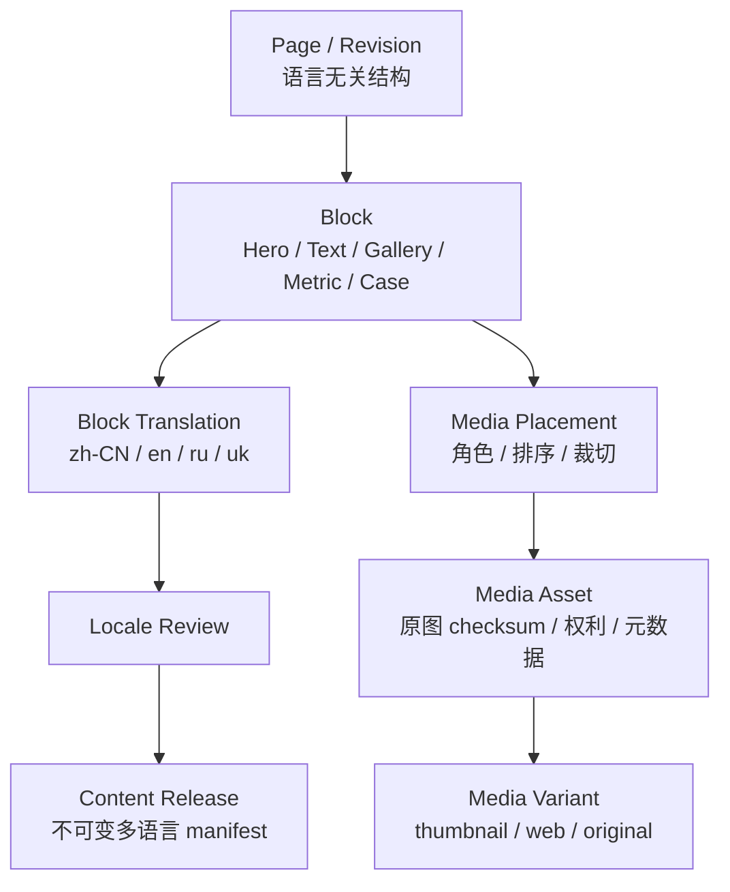

# 多语言企业展示内容管理设计

- **Status**: Draft
- **Date**: 2026-08-27

## Summary

Sales Platform 第一部分应作为内置的结构化 CMS，而不是写死在 React/Electron 包里的静态页面。内容维护人员在后台通过页面树、内容区块和媒体库修改公司介绍、乌兹别克斯坦子公司、生产能力、产品功能与授权案例；中文、英语、俄语、乌克兰语共享同一页面结构，但每种语言拥有独立翻译、审核状态和预览。

图片原文件与派生尺寸存对象存储，MySQL 只保存元数据、引用、checksum、版权与多语言替代文本。发布时冻结一个不可变 `ContentRelease`，客户端按 locale 下载 manifest 和媒体，使用 ETag/版本号增量刷新，不需要重新发布 Electron 安装包。

## Context and Scope

销售人员会像展示公司网站一样向客户浏览图文内容，而且市场信息、人员、生产照片、产品描述和联系方式会持续变化。若这些内容写在前端代码中，每次改字或换图都需要开发、构建和发布 Windows/macOS 客户端，也很难保证四种语言同步。

本设计覆盖：内容编辑、图片维护、翻译、审核、预览、定时发布、回滚、客户端缓存与历史会谈版本固定。它不设计自由建站系统、任意 HTML/JavaScript、公开互联网 SEO 网站或视频转码平台。

## Goals

1. 非开发人员可更新文字、图片、排序和显示/隐藏状态。
2. 一个语言无关的页面结构服务四种语言，避免复制四套页面布局。
3. 每种语言独立显示翻译完整度、过期状态、审核人与发布时间。
4. 图片只上传一次即可跨页面和语言复用；需要时可按语言替换。
5. 发布、回滚和客户会谈引用都可复现，已展示内容不被后续修改。
6. Web/Electron 在联网时自动取得最新已发布内容，离线时使用最后一次验证通过的发布包。
7. LLM 可生成翻译草稿，但不得绕过语言审核和发布权限。

## Non-Goals

- 不允许编辑者注入任意 HTML、CSS、JavaScript 或远程脚本。
- 不在 MySQL 中保存大图片或视频二进制。
- 不要求一次修改必须重新发布前端代码或 Electron 安装包。
- 不把俄语和乌克兰语合并为一个语言版本。
- 不用 CMS 维护设备工程规格、推荐规则或正式流程数据。

## Constraints

- 首期 locale 固定为 `zh-CN`、`en`、`ru`、`uk`。
- 内容后台受 BMS 身份和 Sales Platform 逻辑权限控制；BMS 正式权限码待集成确认。
- Electron 必须支持偶发断网场景，但不能把草稿或失效内容缓存成客户可见内容。
- 图片可能较大，需要生成缩略图、展示图和原图链接，并适配不同屏幕。
- 已开始的客户会谈要记录当时使用的内容发布号。

## Proposed Design

### 1. 三层内容模型



- `ContentPage`：稳定页面标识、路由、栏目和排序。
- `ContentRevision`：一次语言无关的页面结构修改；包含有序区块。
- `ContentBlock`：受控模板区块，只保存结构、布局参数和非语言字段。
- `BlockTranslation`：每个区块每种 locale 的标题、正文、按钮、caption、alt text 等。
- `MediaAsset`：对象存储中的原始媒体及 checksum、尺寸、版权、授权到期日。
- `MediaVariant`：Worker 生成的 thumbnail/web/original 等派生文件。
- `MediaPlacement`：媒体在区块中的角色、顺序、焦点和可选 locale 覆盖。
- `ContentRelease`：一次发布所冻结的页面、翻译、媒体和 checksum 集合。

### 2. 编辑工作台

后台使用固定区块编辑器，而不是富文本网页源码编辑器：

- 左侧：页面树、栏目、显示顺序和生效范围。
- 中间：区块拖拽排序及 Hero、图文、画廊、指标、产品卡片、案例卡片等模板。
- 右侧：当前 locale 的标题、正文、按钮、图片、caption、alt text 和发布设置。
- 顶部：四语言矩阵，显示 `MISSING / DRAFT / STALE / IN_REVIEW / APPROVED / PUBLISHED`；`MISSING` 由不存在翻译记录计算，不保存空占位行。
- 预览：桌面、窄屏和客户演示模式；可生成仅内部可见的带过期时间预览链接。

源语言修改后，系统比较字段 checksum，只把受影响的其它语言字段标成 `STALE`，不清空人工翻译。编辑者可以保留、重译或逐字段确认。

### 3. 媒体库

- 上传时校验 MIME、扩展名、大小、恶意文件和图片解码结果。
- 以 checksum 去重；相同图片不重复占用存储。
- 保存标题、摄影来源、版权/授权范围、到期时间、人物/客户授权状态。
- Worker 生成 AVIF/WebP/JPEG 回退和多种尺寸；客户端通过 manifest 选择合适 variant。
- 默认所有语言共用同一图片。若图片含文字或地区不同，可在 `MediaPlacement.locale` 指定语言专用图片。
- 焦点坐标与裁切策略存 placement，不破坏原图。
- 删除只对未发布草稿生效；已被历史 release 引用的资产不能物理删除，只能停用并保留归档。

### 4. 翻译工作流

1. 内容编辑者完成源语言草稿。
2. 系统生成翻译任务和术语提示。
3. 人工翻译或 LLM 生成 `LLM_DRAFT`。
4. 对应语言审核人逐字段确认；关键术语、联系方式、数字和免责声明必须人工核对。
5. 四语言完整度与阻断项在发布矩阵中展示。

页面结构共用，但译文长度不受源语言字符数强行限制。预览需检查俄语/乌克兰语长文本、换行、图片中文字和按钮宽度。

### 5. 审核和发布

建议逻辑权限：

- `sales_platform.content_edit`：编辑页面结构与源语言草稿。
- `sales_platform.content_translate`：编辑被分配语言的翻译。
- `sales_platform.content_review`：批准页面/语言版本。
- `sales_platform.content_publish`：创建、定时发布或回滚 release。
- `sales_platform.media_manage`：上传、停用和管理媒体权利。

这些权限与 `sales_platform.data_maintain` 分开，避免能维护工程数据的人自动获得客户宣传内容发布权。实际 BMS 权限码通过映射表接入。

发布时执行：结构校验、必填翻译、客户安全、媒体可用、版权有效、链接白名单、图片 alt text 和四语言预览门禁。成功后冻结 release manifest；发布不是原地修改旧版本。回滚通过重新激活前一个 release 或发布一个后继 release 完成，并记录原因。

支持 `publish_at_utc` 定时发布。编辑界面按用户时区显示，发布记录同时显示 UTC 与所选 IANA 时区。

### 6. 客户端获取与缓存

```text
App 打开 / 恢复联网
  → GET current release manifest(locale, channel)
  → If-None-Match / ETag
  → 304：继续使用本地已验证 release
  → 200：校验 manifest checksum，下载缺少的媒体 variant
  → 原子切换 current release 指针
```

- React 按结构化区块渲染，不执行 CMS 提供的脚本。
- Web 可通过 CDN/对象存储读取媒体；Electron 缓存 manifest 与已用媒体。
- 下载未完成或 checksum 错误时继续使用上一版，不显示半新半旧页面。
- 首次启动且无法取得任何发布包时显示明确离线状态，不回退到草稿或硬编码陈旧宣传信息。
- `ConsultationSession.content_version_manifest` 固定客户当次会谈实际看到的 release/page/locale/checksum。

## Interfaces and Data

主要 API：

```text
GET    /sales-content/releases/current?locale=zh-CN&channel=SALES
GET    /content-pages
POST   /content-pages
POST   /content-pages/{pageId}/revisions
PUT    /content-revisions/{revisionId}/blocks
PUT    /content-revisions/{revisionId}/translations/{locale}
POST   /content-revisions/{revisionId}:submit-review
POST   /content-revisions/{revisionId}:approve
POST   /media-assets
POST   /content-releases
POST   /content-releases/{releaseId}:publish
POST   /content-releases/{releaseId}:rollback
```

发布事件 `SalesContentReleasePublished` 至少包含 release ID、release number、locale 列表、manifest checksum、发布时间和发布人。客户端不直接订阅数据库变更；应用打开、恢复联网或接到安全通知时重新校验 current release。

## Alternatives Considered

### 文案和图片写入前端代码

开发简单，但任何小改动都要重新构建 Web/Electron，四语言容易分叉，历史客户展示不可复现，因此拒绝。

### 接入通用 Headless CMS

编辑体验成熟，但会引入另一套身份、权限、部署、数据驻留和发布审计。首期内容类型有限，先在 Sales Platform 内实现受控区块 CMS；未来可在 API 边界后替换。

### 四种语言复制四套页面

操作直观，但页面结构、图片和排序很快漂移。采用共享结构 + locale translation；仅允许媒体 placement 按语言覆盖。

### 保存任意 HTML

灵活但存在 XSS、Electron 远程内容执行、响应式失控和难以审计的问题。采用白名单结构化区块。

## Tradeoffs

- 结构化区块不如自由网页编辑器灵活，但更安全、可预览、可跨端一致渲染。
- 原子 release 增加版本和存储数量，但避免客户看到混合版本。
- 四语言人工审核增加发布时间；换来客户可见内容的可信度和责任追踪。
- 自建轻量 CMS 需要媒体处理与编辑器工作；避免独立 CMS 的集成和权限复杂度。

## Cross-Cutting Concerns

- **Security**：媒体上传扫描、CSP、URL 白名单、无任意 HTML/JS、最小权限。
- **Privacy**：客户案例和人物图片必须保存授权范围与到期时间。
- **Reliability**：对象存储版本化、release manifest checksum、CDN 失败回退上一版。
- **Observability**：翻译滞后、媒体失败、发布失败、缓存命中、旧客户端使用率与回滚次数。
- **Performance**：响应式图片、懒加载、首屏优先、按 checksum 去重。
- **Accessibility**：图片 alt text、标题层级、对比度和键盘预览检查。

## Rollout and Migration

1. 先建立页面/区块模板、媒体库和四语言状态矩阵。
2. 将当前公司介绍资料作为第一批草稿导入；源文件未提供前不虚构内容。
3. 完成浏览器/Electron 预览与 release 缓存，验证弱网和离线回退。
4. 选一个公司介绍页面跑通四语言编辑—审核—发布—回滚。
5. 再迁移子公司、生产能力、产品和案例页面。

## Open Questions

1. 谁分别拥有内容编辑、各语言审核、媒体权利审核和最终发布权限？
2. 第一批页面和图片源文件、现有网站内容及使用权证明何时提供？
3. 图片是否允许外部 CDN，还是必须留在公司对象存储/121 周边环境？
4. 四语言是否必须每次同时发布，还是允许单语言先发布且其它语言保持上一 release？建议默认允许各语言独立保持上一已发布版本，但不能混用草稿。
5. 是否需要把公开公司网站也接入同一 CMS？本设计目前只覆盖 Sales Platform。

## Decision

建议批准“结构化多语言 CMS + 对象存储媒体库 + 不可变 ContentRelease + 客户端 ETag/离线缓存”方向。产品、内容负责人、四语言审核人、安全/运维和前端负责人应在实现前确认权限、媒体存储、首批页面及跨语言发布策略。
