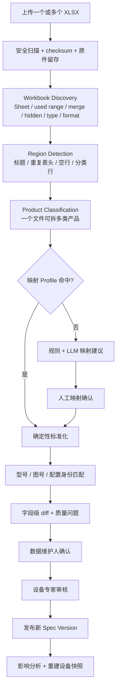
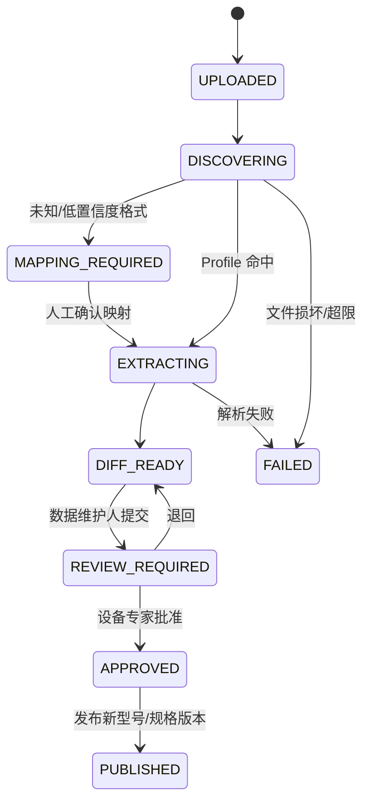
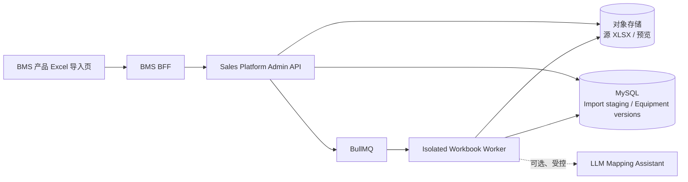

# 非标准产品 Excel 导入、差异比对与发布设计

## Status

Draft — 基于 2026-08-28 提供的六份真实产品工作簿形成，待产品数据负责人、设备专家、BMS、Sales Platform 后端和 DBA 评审。本文是设计方案，不表示产品数据已经导入或发布。

## Summary

Sales Platform 应支持把任意来源的 `.xlsx` 文件作为**候选数据来源**，但不能把“任意 Excel”理解为“无需确认即可自动更新正式产品库”。推荐采用：

> 文件原件留存 → 工作簿结构发现 → 多区域/多产品识别 → 版本化字段映射 → 原值与标准值并存 → 身份匹配 → 新增/更新/冲突差异 → 人工确认 → 新规格版本发布。

一个文件可以包含多个 Sheet、多个重复表头、多个产品系列，甚至多个设备类型。系统先拆成 logical regions，再逐区域解析。高置信度映射可以批量确认；低置信度、日期误识别、空白继承、同型号多图号和字段冲突必须进入人工映射/审核页面。任何导入都先进入 staging，不直接覆盖 `equipment_*` 已发布数据。

## Context and Scope

本次只读检查了以下工作簿：

| 文件 | Sheet / logical regions | 候选记录 | 需要特别处理 |
|---|---:|---:|---|
| `矿机产品在销售版本明细表（2026.4.13持续更新）.xlsx` | 12 / 17 | 520 | 60 条缺型号、97 条记录落入重复身份组合；覆盖给矿、破碎、洗矿、筛分、磨矿、分级、搅拌、浮选、输送和给料设备 |
| `圆振动筛产品参数表-260626.xlsx` | 1 / 2 | 56 | 2 条有图号但缺型号，必须显示为冲突，不自动接受 |
| `直线筛产品在销售版本明细表-2026.4.20.xlsx` | 2 / 5 | 93 | 一个工作簿同时包含直线筛和分级机；1 条缺型号记录 |
| `洗矿机产品在销售版本明细表(2026.04洗矿机更新).xlsx` | 1 / 2 | 13 | 同一 Sheet 中途由槽式字段切换为圆筒字段 |
| `矿机产品在销售版本明细表2026.05.19(分级机).xlsx` | 1 / 1 | 38 | 分级机专项更新，应比旧总表拥有更高人工比对优先级 |
| `球磨机和棒磨机在销售版本明细表（2026.4.13持续更新）.xlsx` | 1 / 1 | 69 | 球磨机与棒磨机共用区域，需要在映射后保留产品子类 |

六份文件合计 18 个 Sheet、28 个 logical product regions、789 条候选记录。文件之间存在重复型号和新旧版本关系，因此不能把各文件的新增/更新数量直接相加，也不能按上传顺序自动覆盖。

仓库中的 `data/product-import/workbook-manifest.json` 固化每份文件的 SHA-256、文件大小、Sheet、区域、标题行、产品类型和**原始 Excel 列标题**；`catalog-preview-baseline.json` 保存相对 110 条现有目录的只读比较基线。两者是可审计证据，不是发布批准。

实际不一致包括：

- 合并单元格把系列、名称、筛面规格、配置和备注视觉上向下覆盖，但底层后续单元格为空；
- 同一型号可以出现不同图号、重量、尺寸、频率或驱动配置，不能简单按型号覆盖；
- `～`、`-`、`—`、`≤`、`≦`、“小于”等多种范围/上限表达；
- `2×7.5`、`2x11`、`5.5（给矿型7.5）` 表示不同功率语义；
- `Kg`、`t` 同时存在，而且“报价重量”不一定等于 kg/1000；
- 尺寸使用 `*`、`×`、`x`，部分单元格写“无记录”“无图纸，无数据”；
- 直线筛的“双振幅”区间在部分单元格被 Excel 当成日期储存，读取原始值时出现 `46181`，但表面显示仍为 `6/8`；解析器必须同时保存 raw value、formatted text 和 number format；
- 价格列存在但当前为空，不能把空值解释为零；
- 文件名/Sheet 名不能可靠代表全部产品类型，因为直线筛工作簿中还包含分级机。

本设计覆盖产品目录导入、字段映射、标准化、去重、差异展示、审核和发布；不覆盖报价计算或根据文件缺席自动下架产品。

## Goals

1. 支持一个 `.xlsx` 中多个 Sheet、多个表格区域和多个产品类型。
2. 对已知模板自动复用映射，对未知模板提供可审核的映射建议和手工兜底。
3. 同时保留单元格原值、格式化显示、位置、合并关系、原单位和标准值。
4. 准确区分新型号、新配置/新图号、已有型号更新、无变化、冲突和无法识别。
5. 在 BMS 清楚显示“本次新增加了什么、更新了什么、为什么这样判断”。
6. 不因空单元格、缺席行、Excel 日期误识别或格式变化破坏已发布数据。
7. 经审核后创建不可变 `equipment_spec_version`，而不是原地覆盖正式规格。

## Non-Goals

- 不保证任何陌生 Excel 都能 100% 无人工处理导入。
- 不让 LLM 直接决定型号身份、数值单位、工程能力或发布结果。
- 不用文件中缺少某型号推断该型号已停产/下架。
- 不在第一阶段解析宏、外部链接、嵌入式 CAD 或图片中的表格。
- 不把价格空白当成零，也不在技术目录导入中自动计算报价。
- 不修改用户提供的源工作簿。

## Constraints

- 源文件必须原样保存在受控对象存储，并以 checksum 去重和追溯。
- 解析 Worker 使用隔离环境，限制文件大小、Sheet 数、行列数、压缩率和执行时间。
- `equipment_equipment_model` 保持稳定身份，已发布规格通过新 `equipment_equipment_spec_version` 演进。
- BMS 前端只调用 BMS BFF；BFF 调用 Sales Platform Admin API，不直接操作 MySQL。
- 数据维护、设备审核和设备发布使用独立权限，默认禁止提出人自审高风险变更。
- 所有导入时间保存 UTC，页面使用用户 IANA 时区显示。

## Proposed Design

### 1. 三种识别模式

| 模式 | 触发条件 | 自动化程度 | 处理方式 |
|---|---|---|---|
| 已知映射 Profile | 表头指纹、Sheet/区域特征与已批准 Profile 匹配 | 高 | 自动拆区和映射，仍展示差异并审核 |
| 智能建议 | 未知格式，但能检测表头、型号列和单位 | 中 | 规则优先，LLM 只建议产品类型/字段映射；人工确认后继续 |
| 手工映射 | 表头置信度低、区域混杂或关键列不确定 | 低 | 用户选择标题行、数据范围、产品类型、字段和单位；确认后可保存新 Profile |

“支持任意 XLSX”依靠第三种安全兜底实现，而不是假设每个文件都有统一表头。

### 2. 导入流水线



### 3. 工作簿结构发现

Worker 首先记录而不是解释：

- 文件/Sheet 名、used range、隐藏 Sheet/行/列、合并区域、空白行；
- 每个单元格的 raw value、formatted text、formula、number format、数据类型和坐标；
- 字体、填充、边框和合并关系仅作为结构提示，不作为工程事实；
- 重复表头、标题行、说明/注释行和小计/空区；
- 文件级/Sheet 级语言和候选产品类型。

Region 检测使用表头关键词密度、连续非空矩形、重复表头、标题样式和空行边界。每个 logical region 有自己的标题、header row、数据范围、产品类型和 mapping profile；不能强迫一个 Sheet 只能有一个 schema。

### 4. 字段映射 Profile

Profile 必须版本化，最少包含：

- 产品类型/系列适用范围；
- 表头别名，例如 `型号规格 | 规格型号 → model_code`；
- 单位与列语义，例如 `参考重量 Kg`、`报价重量 t` 是两个不同字段；
- 可安全向下继承的列白名单；
- 范围、尺寸、功率、电机、图号和配置解析规则；
- 必填字段、质量规则和发布风险等级；
- 适用的表头指纹与测试样本 checksum；
- 创建、审核、发布人和版本。

Profile 只能在人工确认后升级为可自动复用；一次 LLM 建议不能自动“学习”为正式映射。

### 5. 行、型号与配置聚合

#### 空白继承

合并单元格或视觉分组造成的空白只在以下条件向下继承：同一 region 内、来源是合并范围或 Profile 白名单字段、未遇到新标题/表头/注释/空区。`系列`、`名称`、通用供货范围可允许继承；`型号`、`图号`、重量、功率等行级字段默认不继承。

#### 稳定身份

- 商业型号：`manufacturer + normalized_model_code`；
- 规格/配置候选：商业型号 + drawing number + 关键配置 fingerprint；
- 同型号不同图号：默认识别为同一型号的不同规格候选，不互相覆盖；
- 空型号但有图号：尝试挂到同一区域上一商业型号，标记 `INHERITED_MODEL_REVIEW_REQUIRED`；
- 模糊型号只产生匹配建议，不能自动合并。

此次文件中的 `YK-1530`、`FG-2400`、`2FG-2400` 已证明 `model_code` 不能单独作为“唯一一行规格”的键。

### 6. 规范化和质量规则

所有解析字段保存四份信息：`rawValue`、`displayText`、`normalizedValue`、`sourceLocator`。

| 类型 | 示例 | 标准化结果 |
|---|---|---|
| 范围 | `15～90`、`40-360`、`5-13.5` | `{min, max, minInclusive, maxInclusive, unit}` |
| 上限 | `≤50`、`≦300`、`小于200` | `{max, maxInclusive}`，保留原操作符 |
| 尺寸 | `6760*1520*2340` | `length/width/height` + 原文；方向不确定时不得猜测 |
| 功率阵列 | `2×7.5`、`4×8` | `motorCount`、`unitPowerKw`、`totalPowerKw` |
| 条件替代 | `5.5（给矿型7.5）` | 基准功率 + 条件替代配置，不按 13 kW 相加 |
| 重量 | `4572 Kg` 与 `4.6 t` | `referenceWeightKg`、`quotedShippingWeightT` 分开保存 |
| 缺失 | 空白、`无记录`、`无图纸，无数据` | `MISSING` + reason，不写 0 |
| 日期误识别 | raw=`46181`、显示=`6/8`、列=`双振幅` | `DATE_COERCION_SUSPECT`，使用显示文本建议 `6–8 mm`，必须复核 |

单位换算、范围解析和日期异常使用确定性规则。LLM 只可解释长备注、提出字段映射和产品类型建议。

### 7. 新增与更新判断

系统先与当前已发布产品目录比较，再产生以下状态：

| 状态 | 判断 | 默认动作 |
|---|---|---|
| `NEW_MODEL` | 没有匹配商业型号 | 新建型号候选 |
| `NEW_VARIANT` | 型号存在，但图号/配置 fingerprint 不存在 | 新建规格/配置候选 |
| `UPDATE` | 身份匹配，至少一个标准化业务字段变化 | 创建下一规格版本候选 |
| `FORMAT_ONLY` | 原文/格式变化，标准化语义相同 | 默认不发布，可更新来源证据 |
| `NO_CHANGE` | 语义和来源均无变化 | 跳过 |
| `CONFLICT` | 多来源对同一字段给出不同值，无法按版本/优先级解决 | 阻止批量发布，专家裁决 |
| `INCOMPLETE` | 缺型号、产品类型、关键单位或必要来源 | 阻止发布，允许保存 staging |
| `RETIREMENT_CANDIDATE` | 文件显式声明停产/停售 | 单独审核；仅“文件中没出现”不触发 |

Diff 以字段为单位展示：字段中文名、数据库旧值、Excel 建议值、原始文本/单位、来源 Sheet/单元格、解析规则、置信度、质量问题和最终选择。

### 8. BMS 页面

路径建议：`Sales Platform 管理中心 → 数据中心 → 产品 Excel 导入`

#### Step 1 上传

文件、来源日期、负责人、数据分类和备注；显示 checksum 重复提醒。

#### Step 2 结构识别

显示 Sheet 列表和检测出的 logical regions：标题、范围、候选产品类型、表头行和置信度。用户可拆分、合并或排除区域。

#### Step 3 字段映射

左侧 Excel 表头/样例，中间标准字段，右侧单位/解析规则/继承策略。已知 Profile 自动带出；陌生格式必须确认。

#### Step 4 导入结果

顶部显示 `新增型号 / 新配置 / 更新 / 仅格式 / 无变化 / 冲突 / 无效` 数量；下方按文件、Sheet、产品类型、状态和风险筛选。

每个候选行显示型号、图号、产品类型、来源位置、差异字段数、质量状态和建议动作。点击进入字段级 old/proposed/source 对比；可回看原 Sheet 区域截图或定位坐标。

#### Step 5 确认与提交审核

低风险、无冲突记录可批量接受；高风险能力、重量、功率、尺寸、最大给料粒度和产品类型必须逐项或按已批准策略确认。被排除记录保留理由。

#### Step 6 审核与发布

设备专家查看 change manifest 和影响分析。批准后创建新型号/规格版本并发布；已发布旧版本被 supersede，但历史推荐与文件仍指向原版本。

### 9. 发布语义



重复上传同一 checksum 返回已有 ImportBatch；重复发布同一 manifest 使用幂等键返回同一结果。任何失败都保留原件、解析版本、日志摘要和可重跑入口。

## Architecture Views

### 运行组件



### 权威数据流

Excel 是证据来源，不是在线产品目录。`gov_source_document` 保存原件；Import staging 保存结构和候选；`gov_extracted_fact` 保存字段事实；`gov_data_change_request/item` 保存 old/proposed；只有批准发布后才写入新的 `equipment_equipment_model/spec_version/capability`。

## Interfaces and Data

### 已纳入仓库的 staging migration

现有 83 表基线已具备 SourceDocument、ExtractedFact、DataChangeRequest 和 EquipmentVersion，但缺少工作簿/区域/映射/候选生命周期。`database/002_product_import_staging.sql` 已把以下结构纳入设计交付；它仍需空库验证、DBA 评审和变更窗口后才能执行：

| 表 | 作用 |
|---|---|
| `gov_import_batch` | 文件级任务、checksum、解析器版本、状态、统计和 manifest |
| `gov_import_sheet` | Sheet 名、used range、隐藏状态和结构摘要 |
| `gov_import_region` | logical table 范围、标题/header、产品类型、Profile 和置信度 |
| `gov_mapping_profile` | 版本化表头别名、单位、继承与解析规则 |
| `gov_import_record` | 每个型号/配置候选的 raw/normalized payload、身份和 action |
| `gov_import_record_diff` | 字段 old/proposed/source/validation/decision |
| `gov_import_issue` | 文件、区域、行、字段级质量问题和解决状态 |

不把整个 workbook 只塞进一个 JSON 字段；JSON 保存可变的原始/标准化 payload，状态、外键、身份、action、置信度和审计使用强类型列。

### API 资源建议

```text
POST /admin/product-imports
GET  /admin/product-imports/{importId}
GET  /admin/product-imports/{importId}/events
GET  /admin/product-imports/{importId}/regions
PUT  /admin/product-imports/{importId}/regions/{regionId}/mapping
POST /admin/product-imports/{importId}:extract
GET  /admin/product-imports/{importId}/records
GET  /admin/product-imports/{importId}/records/{recordId}/diff
POST /admin/product-imports/{importId}:submit-review
POST /admin/product-imports/{importId}:approve
POST /admin/product-imports/{importId}:publish
```

上传返回 `202`；结构发现、提取和 diff 通过任务状态/SSE 更新。列表使用服务器分页和状态筛选。

### 权限建议

- `sales_platform.product_import.upload`
- `sales_platform.product_import.map`
- `sales_platform.product_import.review`
- `sales_platform.equipment.publish`
- `sales_platform.product_import.raw_view`

正式 BMS `functionCode` 仍需菜单管理确认。

## Alternatives Considered

| 方案 | 优点 | 失败原因 |
|---|---|---|
| 强制所有人先改成唯一模板 | 实现最简单 | 历史文件、多产品文件和现有工作习惯无法立即统一 |
| 按固定列号直接导入 | 开发快 | 本次文件已有重复表头、列语义切换和 20/21 列差异，会产生静默错位 |
| 完全依赖 LLM 读任意 Excel | 表面灵活 | 不可复现、难处理数值/单位/合并继承，不能安全发布工程数据 |
| 只保存整行 JSON | 兼容性高 | 无法可靠去重、筛选、推荐、diff 和约束 |
| 结构发现 + Profile + 人工兜底 + 版本发布 | 可兼容真实文件且可审计 | 需要 staging、映射 UI 和领域规则投入；推荐采用 |

## Tradeoffs

- 支持陌生 XLSX 会增加解析和映射 UI 成本，但能逐步把现有文件转为可治理资产。
- 保存 raw/display/normalized 三层数据占用更多空间，却能处理 Excel 日期误识别并提供可靠证据。
- 同型号多图号按配置候选处理会产生更多审核项，但避免错误覆盖真实设备版本。
- Mapping Profile 能提高后续自动化率，但必须建立 Owner、测试样本和版本发布流程。

## Cross-Cutting Concerns

- Security：限制文件大小/压缩率，恶意文件扫描，解析 Worker 无外网、低权限、资源限额。
- Privacy：源文件按 INTERNAL/CONFIDENTIAL 分类；原始预览和下载单独授权。
- Observability：记录每阶段耗时、识别区域数、映射置信度、各 diff 状态数量、失败原因和人工修正率。
- Reliability：checksum 去重、任务幂等、可重跑、发布 manifest、Outbox 和失败不写正式表。
- Performance：分 Sheet/Region 流式处理；列表分页；大文件限制并后台异步。
- AI Governance：记录模型/prompt/输入 checksum；只建议映射和文本拆分；可完全关闭。
- Time：文件来源日期与上传时间分开；保存 UTC，按 IANA 时区显示。

## Rollout and Migration

### Phase X0：金标准和字段字典

- 用本次 6 文件标注 28 个 regions、表头、型号/图号关系和异常样本；
- 确认给矿、破碎、洗矿、筛分、磨矿、分级、搅拌、浮选、输送和给料设备的 canonical fields；
- 确认“同型号不同图号”的正式业务语义。

### Phase X1：只读导入预览

- 上传、结构发现、手工拆区/映射、标准化、质量问题和 diff；
- 不允许发布，只与测试目录比较；
- 建立本次文件对应的首批 Mapping Profiles。

### Phase X2：审核与受控发布

- 新型号/新配置/更新审核；
- 只对白名单产品类型开放发布；
- 每批发布前导出/保存 change manifest，验证回滚和影响分析。

### Phase X3：未知格式与 LLM 建议

- 在确定性路径稳定后加入 LLM 表头/产品分类建议；
- 以人工修正率、字段准确率和错误类型评估，不以“成功读出文件”作为唯一指标。

回退方式：停用导入发布权限或 Mapping Profile；已发布规格通过正常 supersede/rollback 流程恢复，不删除源 ImportBatch。

## Open Questions

1. 同型号不同图号在业务上是“不同可销售配置”“历史设计版本”还是两者都可能？
2. `参考重量`、`报价重量`、`运输重量` 的正式定义和推荐/报价分别使用哪个字段？
3. 底价/报价是否进入本系统，还是继续由独立报价模块管理？
4. 文件中红字、字体或背景色是否具有稳定业务语义，还是仅作为提示？
5. 哪些产品字段变化可由数据管理员批量接受，哪些必须设备专家逐项审核？
6. 首批 Mapping Profile 是否覆盖全部 6 份文件，还是先对白名单产品类型分批发布？

## Decision

采用 **多区域结构发现 + 版本化 Mapping Profile + 确定性标准化 + LLM 辅助建议 + 字段级 diff + 人工审核 + 不可变规格版本发布**。任何 XLSX 都可进入上传和映射流程，但只有满足身份、单位、质量和权限门禁的记录才能更新正式产品库。批准人至少包括产品数据负责人、设备专家、Sales Platform 后端负责人、BMS 集成人员和 DBA。
