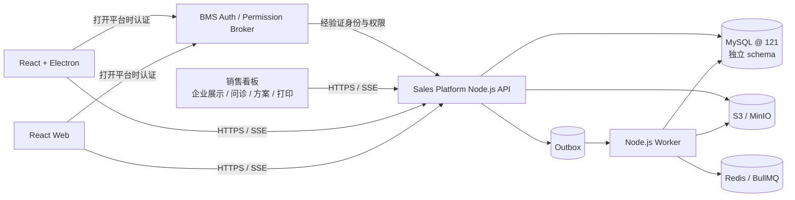
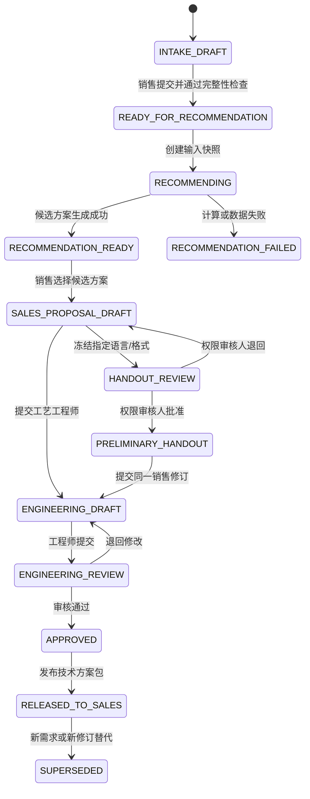
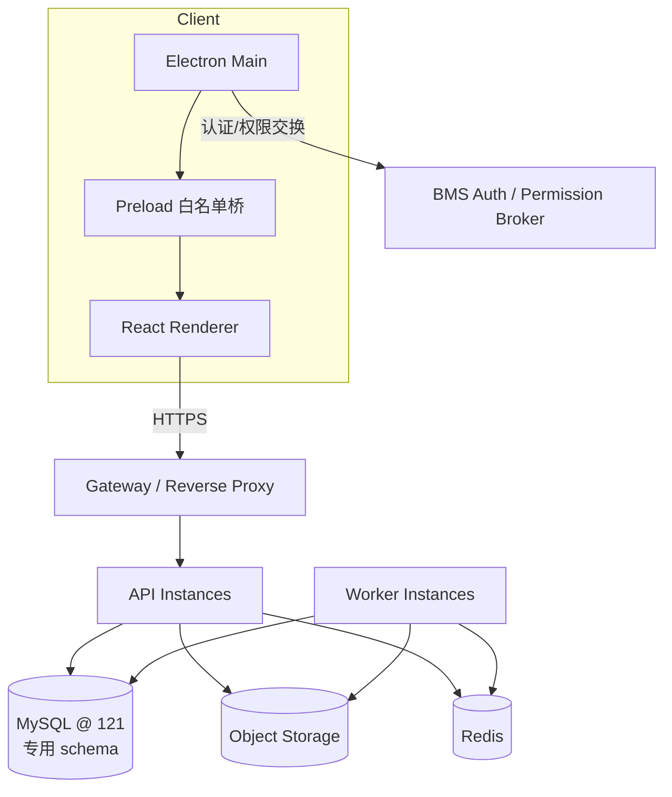

# Sales Platform（销售平台）：主技术设计

## Status

Draft — 待产品、销售、工艺、数据与 BMS/身份集成人员评审。

## Summary

Sales Platform（销售平台）的客户演示与沟通入口称为“销售看板”。选矿工艺与设备推荐是平台的核心领域模块。销售先向客户展示公司、乌兹别克斯坦子公司、生产与服务能力、产品功能和授权案例，再通过引导式会谈采集矿山类型、矿石性质、处理能力、产品目标、脱泥/脱水需求、道路运输和基础设施等信息。系统结合经过审核的历史案例、版本化工程规则和设备能力包络，生成多个可解释的候选工艺流程，并为每个工艺段提供多个设备选项。

企业展示部分采用 Sales Platform 内置的结构化多语言 CMS。页面结构与 `zh-CN`、`en`、`ru`、`uk` 文本分离，图片/视频通过带 checksum 和权利元数据的媒体库复用。内容负责人可在后台改字、换图、排序、预览、审核、定时发布和回滚；Web/Electron 通过不可变 ContentRelease manifest 更新，不需要为了内容变化重新发客户端版本。

销售选定候选后，系统先创建独立的“销售方案修订”。销售可逐段比较设备型号、修改设备选择和运行/备用数量。系统冻结指定语言和 PDF/DOCX 格式的初步客户文件，由具备 `customer.handout.review` 权限的指定人员审核后才能现场交付；该审核不要求工艺工程师参与。随后完整会谈、算法与销售调整记录提交工艺流程工程师，工程师再创建工程修订，调整流程节点、物流、设备、参数、说明和假设，经过校核与审核后发布不可变正式方案。

推荐采用：

- Sales Platform 是 BMS/CRM 之外的独立系统，并自行创建项目；
- 用户打开平台时通过 BMS 认证，BMS 后端负责身份与权限交换适配；
- BMS 内提供独立管理控制面，经 BMS BFF 调用 Sales Platform Admin API；BMS 不复制领域数据；
- React + Electron 前端计划独立仓库交付，平台业务后端部署位置暂待确认；
- TypeScript + Node.js 模块化单体 API，加独立 Worker；
- 121 服务器上的独立 MySQL schema 保存规范化、版本化数据；对象存储保存原始资料和报告；
- React Web UI 复用到 Electron Renderer；
- 规则、案例相似度、图算法和确定性校核组成混合推荐引擎；
- Phase 1 加入受控 LLM 实验，但模型输出不得绕过规则校核与人工审核；
- 客户内容与文件支持中文、英语、俄语、乌克兰语，时间按项目/用户 IANA 时区显示；
- 企业展示通过结构化区块 CMS、对象存储媒体库和不可变 ContentRelease 持续更新；
- 算法候选、销售方案修订、工程修订、正式发布四个层级严格分离。

## Context and Scope

历史方案、流程图、报价、试验报告和运行反馈大多是 PDF、Excel、图片或自由文本，直接交给算法会产生不可解释、不可复现和难维护的问题。销售侧输入也包含“道路不好”“需要除泥”之类模糊描述，必须转成可计算事实。

本设计覆盖：

- 客户/矿山需求的结构化采集和快照；
- 企业/海外子公司/生产能力/产品功能等客户展示内容的结构化编辑、媒体管理、四语言审核、发布与回滚；
- 客户沟通会话、问卷模板、条件问题、原始回答和标准需求映射；
- 历史案例与原始证据的导入、审核和版本治理；
- 工艺流程有向多重图模型；
- 设备类型、型号、版本和能力包络；
- 工程规则和规则测试；
- 候选流程/设备推荐、校核、解释和排序；
- 销售选择后的工程师优化、审核、发布和回传；
- 销售选择后的多设备比较、销售方案修订、初步客户打印件与工程交接；
- React/Electron、Node API、Worker、数据库和对象存储边界；
- 安全、审计、测试、运维和分阶段上线。

本设计不把现有 BMS 尚未整理的业务流程当成事实。已确认 BMS 负责平台打开时的认证和权限来源，并由 BMS 后端承接交互适配；具体 JWT、网关、刷新/退出和权限码契约仍须在集成阶段确认。Sales Platform 不依赖 BMS/CRM 项目或报价 ID，而是自行创建项目。

BMS 内部管理入口采用 `docs/bms-control-plane/design.md` 的控制面方案：员工可在 BMS 维护内容、翻译和工程数据，处理合并后的审核与发布，并查看项目/工程记录及权限；不设置独立“审计与运行”菜单。所有新增页面（包括表格/列表页）均从 BMS 菜单管理和权限接口动态生成，禁止写死在 `routes.ts`。所有业务读写仍通过 Sales Platform Admin API，121 的独立 schema 保持唯一可信源。流程图深度编辑、销售设备比较和客户演示继续在独立 React/Electron/Web 平台完成。

## Goals

1. 把非结构化历史资料转为经过人工确认的规范化工程知识。
2. 用同一套可版本化数据支持销售初筛、算法推荐和工程师深化。
3. 每个推荐结论都能回答“为什么推荐、为什么排除、依据是什么”。
4. 保留完整输入、规则、设备目录、案例库和算法版本，使结果可复现。
5. 支持工程师对算法方案进行图形化修改和分段设备细化，不丢失算法原稿。
6. 支持销售面向客户完成企业展示、引导问诊、逐段设备选择和现场打印。
7. 明确区分算法候选、销售初步方案、工程草稿和正式发布。
8. 向销售发布稳定、不可变、可导出的技术方案包。
9. 数据变更必须经过提议、校验、审核和发布，不自动覆盖正式工程数据。
10. MVP 能从少量高质量案例和明确规则起步，不依赖大量训练数据。
11. 支持中文、英语、俄语、乌克兰语和 PDF/DOCX 客户输出。
12. 在不同使用地保留统一时间线，同时正确显示项目和用户当地时间。

## Non-Goals

- 不自动替代选矿试验、物料平衡、详细设计或注册工程师签字。
- 不让 LLM 直接决定正式流程或设备型号。
- 不在第一阶段覆盖报价金额、合同、采购、制造和项目执行全生命周期。
- 不在第一阶段建设通用 CAD/P&ID 系统或高保真 3D 工厂设计。
- 不把所有原始文档字段强行结构化；只结构化算法和审计需要的事实。
- 不承诺用历史相似度证明冶金可行性；相似案例只是证据之一。

## Constraints

- 后端使用 JS 生态，设计基线为 TypeScript/Node.js。
- 前端使用 React + Electron，并尽量保持可同时运行的浏览器版本。
- Windows 与 macOS 必须在同一首发批次支持；共享 React UI 不代表可省略各平台安装、签名、更新和打印验收。
- Renderer 不得直连数据库，也不得持有数据库口令或模型密钥。
- 关键工程数据、规则、推荐和发布方案必须版本化。
- 原始资料可能包含客户隐私与商业秘密，需分类、授权、留痕和可撤销访问。
- 历史资料质量不一致，必须显式保存来源、置信度、完整度和审核状态。
- 项目可能存在磨矿—分级等循环，流程模型不能假设为 DAG。
- 所有持久化业务时间使用 UTC，并为项目、用户和会谈保存 IANA 时区标识。

## Proposed Design

### 1. 逻辑架构



第一阶段采用模块化单体而不是微服务：共享事务、统一审计和快速迭代更重要；长耗时任务放入 Worker。未来只有在团队、负载或部署边界确实独立时才拆服务。

### 2. 业务闭环



销售选择不会修改 `candidate_solution`，而是克隆为 `sales_proposal_revision`。销售的设备切换、数量修改和客户偏好独立留痕；客户文件先冻结为 `customer_handout`，由具备专用权限且默认不同于制作者的主体审核。提交工程后，再从冻结的销售修订创建 `solution_revision`。工程师所有变更保存字段级/图结构级差异及理由。正式发布后冻结输入、流程、设备、说明、依赖和生成文件。

### 3. 推荐流水线

```text
需求归一化与单位换算
  → 输入完整性与红线检查
  → 硬约束预处理（REJECT / REQUIRE）
  → 相似历史案例检索
  → 工艺模块候选组合
  → 图完整性与循环合法性检查
  → 物料/水量/产能粗平衡
  → 设备类型选择
  → 型号、数量、运行/备用配置筛选
  → 运输、电力、场地和维护约束检查
  → 多目标评分与场景生成
  → 解释、证据、假设和缺失信息汇总
```

候选场景至少包括平衡方案，按需求可增加低投资、高可靠性、低水耗、低能耗、扩产和运输受限方案。硬约束不能被权重抵消。

### 4. 数据架构

规范化表是唯一可信源；算法读取不可变特征快照，而不是每次动态关联几十张表。

```text
identity_*       外部用户/组织引用，不复制认证凭据
sales_*          企业展示、问卷、会谈、销售修订、设备备选、初步打印件
project_*        平台内建项目、需求、矿石、场地、物流、目标和项目时区
md_*             词典、单位、工艺类型、设备类型
equipment_*      型号、规格版本、能力包络、运输与运行参数
case_*           历史案例、流程图、设备配置、运行观察
rule_*           规则集、规则、条件、动作、规则测试
rec_*            输入快照、运行、候选方案、评分、解释、依赖
eng_*            工程方案、修订、审核、发布包
gov_*            来源、提取事实、变更申请、质量问题、复核计划
platform_*       Outbox、任务、审计、LLM 运行与本地化文本
```

MySQL 使用一个独立 schema，模块通过表前缀分组。流程图采用 `case_flowsheet_version` + `case_flowsheet_node` + `case_flowsheet_edge`。设备挂载在节点上，布局坐标单独保存。发布后的流程版本不可变。

### 5. 应用模块

- Identity & Access Adapter：对接 BMS 认证与权限；不把 Sales Platform 变成 BMS 模块。
- Admin Projection API：向 BMS BFF 提供任务型总览、待办、内容、数据、发布、项目记录和审计投影。
- Sales Experience：企业展示内容、客户演示模式、会谈与问诊。
- Content & Media：页面/区块编辑、四语言状态矩阵、媒体库、预览、ContentRelease、定时发布和离线缓存 manifest。
- Project Intake：需求、矿石、场地、道路、基础设施和目标。
- Master Data：标准词典、单位和同义词映射。
- Equipment Catalog：设备规格版本、能力包络和历史表现。
- Case Library：历史案例、流程、原始证据和可信度。
- Rule Management：结构化规则、测试、审批和发布。
- Recommendation：快照、候选生成、校核、评分和解释。
- Sales Proposal：多设备比较、销售选择、初步打印件、权限型审核和工程交接。
- Engineering Workspace：流程图编辑、设备细化、差异比较和校核。
- Review & Release：审核、批准、报告生成和销售回传。
- Data Governance：导入、提取、变更、质量、复核和影响分析。
- Product Workbook Import：把一个非标准 XLSX 拆成多个 Sheet/逻辑区域，通过版本化 Mapping Profile、字段标准化和新增/更新/冲突 diff 形成设备变更申请；详细设计见 `docs/product-import/design.md`。
- LLM Experiment：Phase 1 文档提取、映射、翻译/说明草稿和候选建议，完整记录模型、prompt、输入 checksum 与人工处置。
- Audit & Operations：审计、任务、告警、Outbox 和可观测性。

## Architecture Views

### 部署视图



### 信任边界

- Electron Main/Preload 是高权限区；Renderer 视为低信任 Web 环境。
- BMS 认证边界只提供身份和权限来源；Sales Platform API 仍独立执行资源级授权。
- API 是唯一业务写入口。
- Worker 使用服务身份，仅消费白名单任务。
- 对象存储使用短期签名 URL；数据库不存二进制大文件。
- BMS 只传经验证身份/权限或短期交换凭据，不向客户端下发内部服务凭据。

## Interfaces and Data

核心资源：

- `/projects`、`/projects/{id}/requirements`
- `/sales-content`、`/sales-consultations`、`/sales-consultations/{id}/answers`
- `/recommendation-runs`、`/candidate-solutions`
- `/sales-proposals`、`/sales-proposal-revisions/{id}/equipment-selections`
- `/sales-proposal-revisions/{id}:generate-handout`、`:submit-engineering`
- `/customer-handouts/{id}:submit-review`、`:approve`、`:reject`
- `/solutions`、`/solutions/{id}/revisions`
- `/revisions/{id}/flowsheet`、`/equipment-selections`
- `/revisions/{id}/submit-review`、`/approve`、`/release`
- `/equipment-models`、`/historical-cases`、`/rule-sets`
- `/data-change-requests`、`/quality-issues`

跨系统事件：

- `RecommendationCompleted`
- `CandidateSelectedBySales`
- `SalesConsultationCompleted`
- `SalesProposalRevisionReady`
- `PreliminaryCustomerHandoutGenerated`
- `PreliminaryCustomerHandoutApproved`
- `SalesProposalSubmittedToEngineering`
- `EngineeringRevisionSubmitted`
- `EngineeringRevisionApproved`
- `SalesPackageReleased`
- `EquipmentSpecificationPublished`
- `RuleSetPublished`
- `HistoricalCasePublished`

API 细节见 `contracts/openapi.yaml`，事件见 `contracts/events.asyncapi.yaml`，DDL 见 `database/001_initial_schema.sql`。

## Alternatives Considered

### 端到端 LLM 直接推荐

拒绝把端到端 LLM 作为正式推荐器，但 Phase 1 开展受控实验。LLM 可用于文档提取、字段映射、翻译/说明草稿和候选建议；输出进入暂存/审核区或确定性校核链，必须保存模型、prompt、输入 checksum、输出和人工处置。

### 一开始拆成多微服务

暂不采用。当前领域边界仍在形成，跨服务事务、部署和观测成本会拖慢验证。模块化单体保留清晰包边界和事件接口，成熟后可拆。

### 图数据库作为主存储

暂不采用。流程遍历并非当前唯一核心负载，版本、审核、审计和报表更适合关系数据库。MySQL 节点/边表足以表达有向多重图，算法运行时加载到 Graphology。若未来出现跨百万图谱的复杂遍历，再评估图数据库读模型。

### Electron 承载数据库与推荐逻辑

拒绝。会造成密钥泄露、版本漂移、多人协作冲突和难以审计。Electron 只作为安全薄客户端。

### 只使用相似案例

拒绝。历史相似不等于工程可行；必须先过硬约束和能力校核，再把案例相似度作为评分和解释的一部分。

## Tradeoffs

- 严格版本化增加表数量与存储，但换来复现、审计和安全发布。
- 销售方案层增加一次版本转换，但保留了客户现场选择，且不会污染算法原稿或提前进入工程生命周期。
- 结构化规则比自由脚本表达能力受限，但工程师更容易审核，且避免执行任意代码。
- MySQL 节点/边模型不如专用图数据库便于深度遍历，但可复用 121 运维能力，并显著简化事务、权限和数据治理。
- 模块化单体初期效率高，但需要强制模块依赖规则，防止演化成“大泥球”。
- Electron 提供桌面体验，但带来更新、签名和 Chromium 安全维护成本；因此保持同源 Web UI。

## Cross-Cutting Concerns

- Security：最小权限、服务端授权、Electron 沙箱、IPC 白名单、CSP、敏感字段加密、附件防病毒。
- Privacy：项目级数据域、客户资料分级、下载水印、保留期和删除策略。
- Reliability：推荐和报告任务幂等，Outbox，重试与死信，数据库备份和恢复演练。
- Observability：每次请求、任务和推荐运行统一 trace ID；记录各阶段耗时、候选数和淘汰原因。
- Performance：列表分页，特征快照，批量加载图，持久化读模型/快照表，异步重计算。
- Cost：MVP 复用 121 MySQL，并使用对象存储/Redis；避免提前引入专用向量库和图数据库。
- Explainability：评分分解、命中规则、相似案例、排除原因、数据缺口和版本依赖都持久化。
- Localization/Time：企业展示共享语言无关结构，`zh-CN`、`en`、`ru`、`uk` 各自翻译/审核；发布冻结多语言 ContentRelease。业务时间存 UTC，界面和文件显式显示 IANA 时区与 UTC 偏移。
- Content Delivery：媒体二进制存对象存储并生成响应式 variant；客户端按 ETag/checksum 原子更新，失败时继续使用上一已验证 release。
- AI Governance：LLM 调用记录用途、模型、prompt、输入摘要、token/成本、延迟、输出和接受/拒绝结果；敏感数据出域前必须有策略允许。

## Rollout and Migration

1. Phase 0：确认术语、角色、BMS 认证/BFF/菜单权限契约和首批金标准案例范围。
2. Phase 1：主数据、设备目录、案例库、数据治理、人工流程编辑器、多语言/PDF-DOCX 输出和受控 LLM 实验。
3. Phase 2：硬约束规则、相似案例、候选流程和设备初选。
4. Phase 3：工程师优化、双人审核、销售方案包和销售系统回传。
5. Phase 4：物料/水量精细校核、实际运行反馈、影响分析和再推荐。

上线采用矿种/工艺范围白名单。未覆盖场景必须返回“需要人工设计”，不能猜测。

## Open Questions

- BMS 身份传递采用 JWT 公钥验证、网关签名头还是服务端 introspection？已确认菜单名称与合并关系后，页面编码、跳转路径、BFF 归属和 `functionCode` 是什么？
- Sales Platform 业务后端最终部署在哪里，由哪个团队运维？
- 前端独立仓库、Windows/macOS 签名和自动更新渠道如何建立？
- 首批覆盖哪些矿种、工艺段和设备类型？
- 哪些规则属于强制红线，谁有发布权限？
- 工程方案需单人还是双人审核？哪些金额/风险级别要求更高级别批准？
- 谁维护并审核中文、英语、俄语和乌克兰语内容与术语？
- 第一批公司网站式页面、图片和使用权证明何时提供？媒体存储/CDN 是否必须在公司控制环境？
- 谁可以获得 `customer.handout.review` 和 `sales_platform.data_maintain` 权限，正式 BMS 权限码为何？
- LLM 供应商、数据驻留、成本预算和评测基线是什么？
- 是否已有物料平衡/设备选型公式库可复用？
- 121 的实际 MySQL 版本、`sql_mode`、排序规则、时区、binlog/备份能力是什么？
- 历史资料能否用于 embedding，相应的数据合规边界是什么？若以后接向量服务，部署位置和数据权限如何控制？

## Decision

推荐继续以本设计、`docs/bms-control-plane/design.md`、`docs/product-import/design.md` 和 `docs/content-management/design.md` 作为评审基线；系统边界、项目来源、BMS 管理控制面、非标准产品 Excel 的暂存/diff/审核方向、现场审核、多语言、PDF/DOCX、双平台首发、首期 LLM、时区和结构化内容发布方向已确认。仍需先确定 BMS 认证/权限/BFF 契约、平台后端部署、产品身份/重量语义、内容责任人与首批工程范围，再进入实现。批准人应包括产品负责人、内容负责人、四语言审核人、工艺负责人、销售代表、数据负责人和 BMS/身份集成人员。
